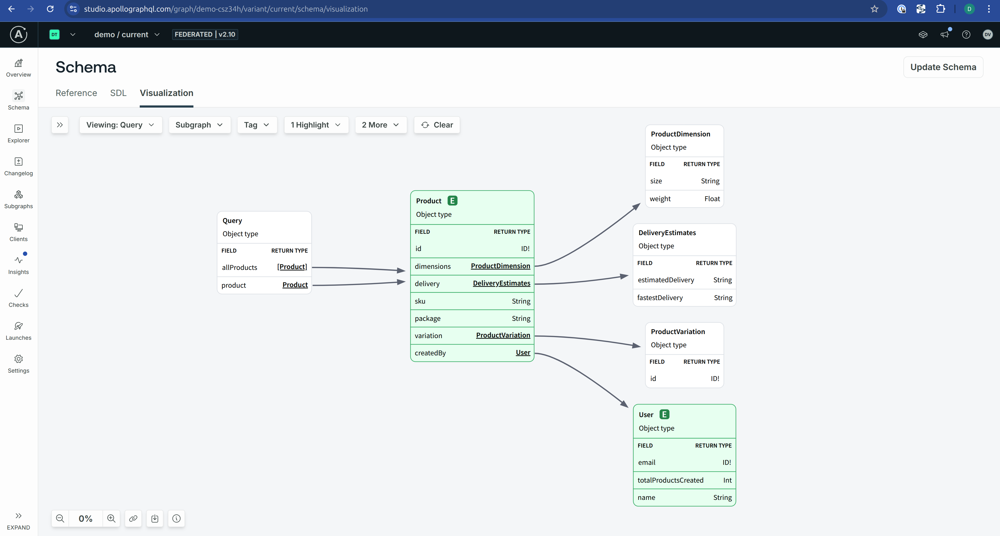
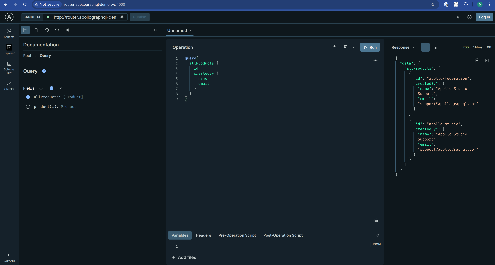
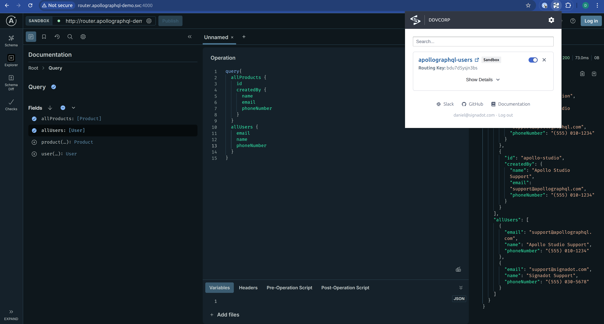
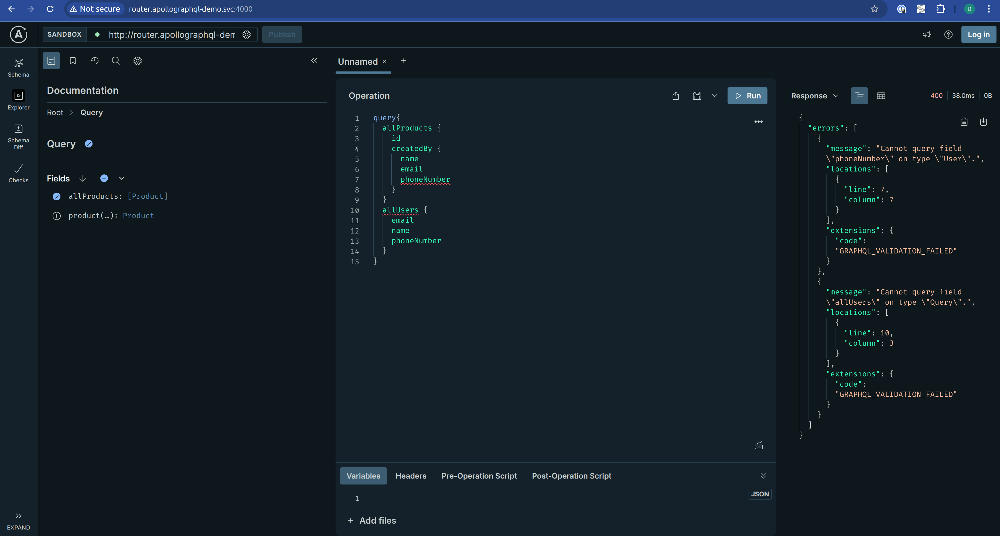
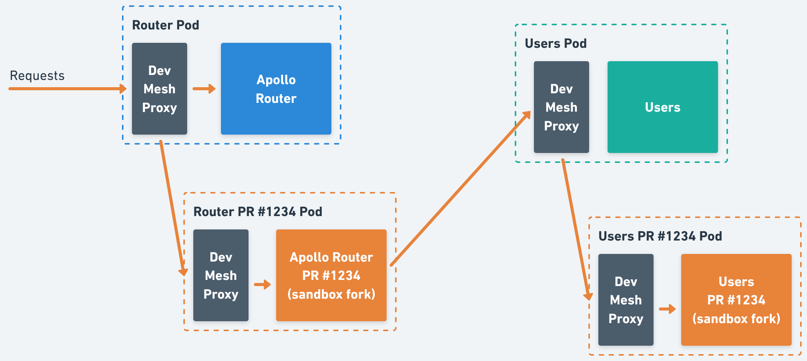

# Using Sandboxes with Apollo GraphQL

# Introduction

Introducing schema changes in a **federated GraphQL architecture** can be tricky. You need a way to safely test and validate new functionality **without disrupting baseline traffic** or impacting other developers. This is especially important in fast-moving teams where multiple changes can happen in parallel.

In this post, we’ll walk through how to combine **Apollo GraphQL** with **Signadot Sandboxes** to create **fully isolated environments** for testing schema updates tied to pull requests.

# Baseline Environment

Before we dive into using **Sandboxes with Apollo GraphQL**, let’s set up a simple baseline environment.

For this guide, we’ll use the [Apollo Supergraph Demo](https://github.com/apollographql/supergraph-demo) and deploy it to a local **Minikube** cluster, running side-by-side with the **Signadot Operator**. This will give us a clean, realistic playground to test how Sandboxes and Apollo can work together.

The demo relies on **Apollo Managed Federation** and the **Apollo Router**, but the same approach can be adapted to other Apollo deployments as well. Think of this as a starting point you can evolve to fit your own setup.

> Prerequisites
> 
> - `kubectl` and `minikube` installed
> - An Apollo Studio account
> - The `rover` CLI installed and authenticated
> - A Signadot account with the operator installed in the cluster
> - The `signadot` CLI installed and authenticated

### Steps

We’ll start by creating a new graph in [**Apollo Studio**](https://studio.apollographql.com/). Once the graph is created, export the following environment variables using the values returned by Apollo:

```bash
export APOLLO_KEY=<generated-key>
export APOLLO_GRAPH_NAME=<graph-name>
export APOLLO_BASELINE_VARIANT=<graph-variant>
```

With those values set, you’re ready to prepare your environment. Run the following commands in your terminal:

```bash
# Clone the signadot/examples repo
mkdir -p ~/git/signadot/
cd ~/git/signadot/
git clone https://github.com/signadot/examples.git

# Clone the apollographql/supergraph-demo repo
mkdir -p ~/git/thrid-party/apollographql
cd ~/git/thrid-party/apollographql
git clone https://github.com/apollographql/supergraph-demo.git

# Build demo images
cd ~/git/signadot/examples/apollographql-tutorial
eval $(minikube docker-env)
./build.sh

# Create the setup all the subgraphs in Apollo Studio
./setup-apollo.sh

# Create the namespace and router secret
kubectl create ns apollographql-demo
kubectl -n apollographql-demo create secret generic router \
	--from-literal=APOLLO_KEY=${APOLLO_KEY} \
	--from-literal=APOLLO_GRAPH_NAME=${APOLLO_GRAPH_NAME} \
	--from-literal=APOLLO_BASELINE_VARIANT=${APOLLO_BASELINE_VARIANT}

# Deploy baseline services + the Apollo Router
kubectl apply -n apollographql-demo -f ./k8s
```

### Validation

At this point, your federated graph should be active and visible in Apollo Studio.
You can open the Studio console to confirm that all subgraphs have been successfully registered and are part of the graph.



You can also explore the router’s **GraphQL Playground** locally using **Signadot**:

1. Start the local connection:
    
    ```bash
    signadot local connect
    ```
    
2. Open the router playground in your browser:
    
    [http://router.apollographql-demo.svc:4000/](http://router.apollographql-demo.svc:4000/)
    
3. Paste and run the following GraphQL query in the editor:
    
    ```graphql
    query{
      allProducts {
        id
        createdBy {
          name
          email
        }
      }
    }
    ```
    



# Using Sandboxes

To safely introduce **schema changes** without impacting the baseline environment, we’ll leverage [**Apollo Variants**](https://www.apollographql.com/docs/graphos/platform/graph-management/variants).

The idea is simple: each **sandbox** corresponds to a **dedicated Apollo variant**, ensuring that schema changes are fully isolated and don’t interfere with the baseline graph.

In a typical setup, **variant creation** happens automatically in the CI pipeline, usually triggered by a pull request. To support this, we provide a helper script called `clone-variant.sh`, which uses the `rover` CLI to fetch all subgraph schemas from the baseline supergraph and publish them into a new PR variant. From there, any specific changes from the PR can be applied on top.

In this demo, we include an alternative version of the `users` subgraph, which introduces a few new queries and a `phoneNumber` field on the `User` entity (you can find the code [here](./subgraphs/users/)). These changes are what we’ll be sandboxing.

To continue with the example, let’s manually create a PR variant, as if this were happening in the context of PR `#1234`:

```bash
export PR_GRAPH_VARIANT="pr-1234"

cd ~/git/signadot/examples/apollographql-tutorial

# Create the PR variant based on the baseline
./clone-variant.sh ${APOLLO_GRAPH_NAME} ${APOLLO_BASELINE_VARIANT} ${PR_GRAPH_VARIANT}

# Apply the schema changes introduced in the PR
rover subgraph publish "${APOLLO_GRAPH_NAME}@${PR_GRAPH_VARIANT}" \
  --schema ./subgraphs/users/users.graphql \
  --name users \
  --routing-url http://users.apollographql-demo.svc:4000/graphql
```

Now let’s create a **sandbox** that forks both the **router** (to point it to the PR variant) and the **users** service (to use the modified image with the schema changes), replace `<cluster-name>` with you corresponding cluster name:

```bash
signadot sandbox apply -f - <<EOF
name: apollographql-users
spec:
  cluster: <cluster-name>
  forks:
    # Fork the router pointing it to the PR variant
    - forkOf:
        kind: Deployment
        namespace: apollographql-demo
        name: router
      customizations:
        env:
          - name: APOLLO_GRAPH_VARIANT
            value: "${PR_GRAPH_VARIANT}"

    # Fork the users workload pointing it to the new version of the service
    - forkOf:
        kind: Deployment
        namespace: apollographql-demo
        name: users
      customizations:
        images:
          - image: signadot/apollographql-demo-users-fg:latest
EOF
```

With this sandbox in place, any request sent using the associated **routing key** will resolve against the forked `users` service and the router configured with the **PR variant**, giving you an isolated environment to safely test the schema changes.

### Validation

If you open the **router playground** again, this time under the context of the **sandbox** you just created, you’ll see the new `phoneNumber` field available on the `User` type, along with the `allUsers` and `user` queries.

In this demo, we’re using the [Signadot browser extension](https://www.signadot.com/docs/guides/developer-environments/access-sandboxes#1-chrome-extension-for-web-applications) to easily route traffic through the sandbox.



If you run the same query against the **baseline environment**, you’ll get an error since the `allUsers` query (and the new `phoneNumber` field) don’t exist in that version of the graph.



# How it Works

Once the sandbox is created, the **request flow** changes slightly so that requests carrying the **sandbox routing key** are routed through the forked workloads instead of the baseline ones.

Here’s how it works step by step:



1. Requests enter through the DevMesh Proxy in front of the **Apollo Router**.
    
    If the request includes the corresponding **routing key**, it’s automatically routed to the **sandbox fork** of the router (in this example, the PR #1234 environment).
    
2. The **sandboxed router** is configured to use the **PR variant** we created earlier.
    
    This means it exposes the updated schema, including the new fields and queries introduced in the forked `users` subgraph.
    
3. To resolve queries, the router uses the **original routing endpoints** defined in Apollo.
    
    However, since the request still carries the **routing key**, the DevMesh proxy forwards the request to the **forked `users` service** instead of the baseline version.
    
4. The response is then returned through the same path, giving the client a fully isolated experience of the new schema, all without affecting production traffic.

# Alternatives and Improvements

### Single Router Mode

In this article we explored integrations using the **built-in capabilities of Apollo**, where each **Router instance can only point to a single graph variant at a time**.

Because of this limitation, every sandbox that includes a schema change must also spin up its own Router instance. While this works well operationally, it is **sub-optimal from a resource perspective**.

Ideally, we’d be able to handle **multiple schema variants within a single Router**. In that model, the router would dynamically **resolve, load, and cache variants on a per-request basis**, trading off increased memory usage for reduced infrastructure footprint.

This more advanced (and therefore more complex) setup is technically possible through a **native Rust plugin in the Router**, which can load and cache multiple supergraph services and dispatch requests to the appropriate variant at runtime.

Though this approach require custom development and add operational complexity, it can reduce the number of running router instances if many short-lived sandboxes are in play.

### Variant Reconciler

In the solution described in this tutorial, the **PR variant** is created at CI time and remains unchanged afterward. However, in a dynamic development environment where multiple changes are happening in parallel, this can lead to **schema drift** between the baseline and the PR variants.

For example, imagine we’re working on **PR #1234**. After submitting the PR and creating the variant and sandbox, another PR, say **#1233,** is merged, introducing changes to the `products` service. The **baseline** now includes those updates, but the **PR #1234 variant** is still based on the old state and doesn’t reflect the new schema.

To address this issue, you can introduce a **variant reconciler process**. This process would detect changes introduced to the **baseline variant** and automatically **propagate them to existing PR variants**, ensuring they stay in sync with the latest baseline. By running this reconciler at the **cluster level**, you can maintain consistency across all active sandboxes without manual intervention.

# Conclusion

Using **Signadot Sandboxes** with **Apollo GraphQL** provides a clean, flexible way to **test schema changes in isolation** without interfering with baseline traffic or blocking other teams. By combining **Apollo Variants** with sandbox routing, each pull request can get its own dedicated environment, enabling faster iteration and safer releases.

We also explored **potential improvements**, such as reducing resource overhead by handling multiple variants in a single router, or implementing a **variant reconciler** to keep PR variants in sync with the baseline as it evolves. These enhancements can make the workflow even more efficient at scale.