# True "Branch-Based Environments": Combining Signadot Sandboxes with Neon DB Branching

Ephemeral sandbox environments solve many problems for microservices teams. You can spin up an isolated copy of your service, test your changes, and tear it down. No conflicts with other developers. No waiting for a shared staging slot.

But here's the catch: your sandbox service still connects to the same staging database as everyone else. One developer's test writes pollute another's queries. Schema migrations break active tests. Seed data disappears mid-run. The application layer is isolated, but the data layer is not.

You will fix that problem by combining Signadot Sandboxes with Neon's database branching to create true full-stack isolation. Every sandbox gets its own application fork and its own database branch. When the sandbox dies, the database branch dies with it. And you will control all of this through conversational prompts in your IDE.

This tutorial shows you how to enable branch-based development using an AI agent and the Signadot MCP (Model Context Protocol) server. After a one-time manual setup, you will manage isolated database environments entirely through natural language prompts in Cursor.

## What You Will Build

The end-to-end system works as follows:

1. A developer asks Cursor to create a Signadot Sandbox
2. The Signadot MCP server translates the request into API calls
3. A Resource Plugin automatically creates a Neon database branch and exposes the connection string as an output
4. The sandbox pod starts with a connection string pointing to the isolated branch
5. The developer runs tests against isolated data
6. The developer asks Cursor to delete the sandbox
7. The Resource Plugin deletes the Neon branch automatically

No shared state. No test pollution. No manual cleanup scripts.

## How It Works

The architecture relies on three key technologies working together.

**Neon Database Branching**: Neon uses copy-on-write storage to create instant database branches. A branch inherits all schema and data from its parent but operates independently. Writes to a branch don't affect the parent, and branches can be created or deleted in seconds with minimal storage overhead.

**Signadot Resource Plugins**: Resource Plugins extend Signadot's sandbox lifecycle with custom provisioning logic. When a sandbox starts, the plugin runs a create workflow. When the sandbox terminates, the plugin runs a delete workflow. Outputs from the create workflow (like connection strings) can be injected directly into sandbox pods.

**Signadot MCP Server**: The MCP server connects Signadot to AI-powered IDEs like Cursor. It exposes sandbox management operations as tools that AI agents can invoke, allowing developers to create, inspect, and delete sandboxes using natural language.

## Prerequisites

Before you begin, ensure you have:

- `kubectl` and `minikube` installed
- A [Neon account](https://neon.tech/) with an API key
- The `neonctl` CLI installed and authenticated
- A [Signadot account](https://www.signadot.com/) with the operator installed in your cluster
- The `signadot` CLI v1.4.0+ installed and authenticated
- [Cursor IDE](https://cursor.com/agents) installed with MCP support enabled

## Setup

The following steps configure the integration between Signadot and Neon. You only need to complete this setup once. After that, you can manage sandboxes entirely through Cursor.

### Step 1: Clone the Example Repository

The example repository contains a pre-built users microservice and all necessary Kubernetes manifests:

```bash
mkdir -p ~/git/signadot/
cd ~/git/signadot/
git clone https://github.com/signadot/examples.git
cd examples/neon-branching-tutorial
```

### Step 2: Set Up the Neon Database

Create a Neon project:

```bash
neonctl projects create --name users-demo
```
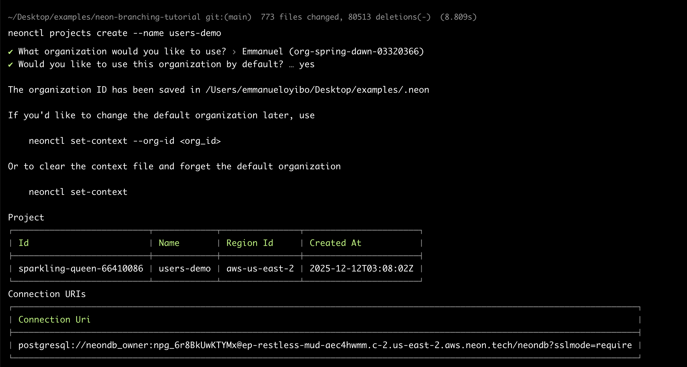

Note the project ID from the output (e.g., `sparkling-queen-66410086`). You'll need it throughout this tutorial.

Retrieve the connection string and create the schema:

```bash
neonctl connection-string main \
  --project-id <your-project-id> \
  --database-name neondb
```

Connect to the database and run the schema file:

```bash
psql "<connection-string>" -f schema.sql
```

The `schema.sql` file creates a `users` table and inserts three seed records. Every sandbox branch will inherit this data.

Generate an API key for the Resource Plugin:

1. Go to the [Neon Console](https://console.neon.tech/)
2. Navigate to **Account Settings > Personal API keys**
3. Click **Create new API key** and save it securely

### Step 3: Deploy to Minikube

Start minikube and build the demo image:

```bash
minikube start

eval $(minikube docker-env)
make build
```

Create the required secrets:

```bash
make setup-db-secret      # Enter your Neon connection string when prompted
make setup-neon-secret    # Enter your Neon API key when prompted
```

Deploy the baseline service:

```bash
make deploy
```

Verify the deployment:

```bash
kubectl get pods -l app=users-service
```
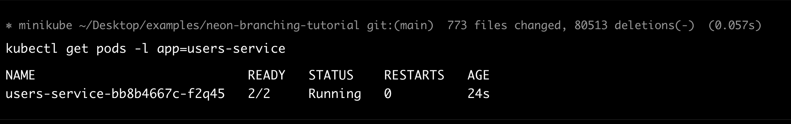

You should see pods in `Running` state with `2/2` containers (the service plus the Signadot routing sidecar).

### Step 4: Install the Resource Plugin

The Resource Plugin bridges Signadot and Neon. Take a look at `neon-branch-plugin.yaml`:

```yaml
name: neon-branch
spec:
  description: Creates and deletes Neon database branches for sandbox isolation
  
  runner:
    image: node:20-alpine
    namespace: signadot
    podTemplateOverlay: |
      spec:
        containers:
          - name: main
            env:
              - name: NEON_API_KEY
                valueFrom:
                  secretKeyRef:
                    name: neon-api-credentials
                    key: NEON_API_KEY

  create:
    - name: createbranch
      inputs:
        - name: project-id
          valueFromSandbox: true
          as:
            env: NEON_PROJECT_ID
        - name: parent-branch
          valueFromSandbox: true
          as:
            env: PARENT_BRANCH
        - name: database-name
          valueFromSandbox: true
          as:
            env: DATABASE_NAME
      script: |
        #!/bin/sh
        set -e
        npm install -g neonctl

        SAFE_NAME=$(echo "${SIGNADOT_SANDBOX_NAME}" | tr -d '-')
        BRANCH_NAME="sandbox${SAFE_NAME}"

        neonctl branches create \
          --project-id "${NEON_PROJECT_ID}" \
          --name "${BRANCH_NAME}" \
          --parent "${PARENT_BRANCH}" \
          --output json > /tmp/branch-output.json

        BRANCH_ID=$(cat /tmp/branch-output.json | grep -o '"id":"[^"]*"' | head -1 | cut -d'"' -f4)

        CONNECTION_STRING=$(neonctl connection-string "${BRANCH_NAME}" \
          --project-id "${NEON_PROJECT_ID}" \
          --database-name "${DATABASE_NAME}")

        mkdir -p /outputs
        echo -n "${BRANCH_NAME}" > /outputs/branch-name
        echo -n "${BRANCH_ID}" > /outputs/branch-id
        echo -n "${CONNECTION_STRING}" > /outputs/connection-string

      outputs:
        - name: branch-name
          valueFromPath: /outputs/branch-name
        - name: branch-id
          valueFromPath: /outputs/branch-id
        - name: connection-string
          valueFromPath: /outputs/connection-string

  delete:
    - name: deletebranch
      inputs:
        - name: project-id
          valueFromSandbox: true
          as:
            env: NEON_PROJECT_ID
        - name: branch-name
          valueFromStep:
            name: createbranch
            output: branch-name
          as:
            env: BRANCH_NAME
      script: |
        #!/bin/sh
        set -e
        npm install -g neonctl
        neonctl branches delete "${BRANCH_NAME}" --project-id "${NEON_PROJECT_ID}"
```

The plugin has three main sections:

- **runner**: Uses `node:20-alpine` with the Neon API key injected via `podTemplateOverlay`. The runner executes in the `signadot` namespace where the API key secret exists.
- **create**: Installs `neonctl`, creates a branch named after the sandbox, retrieves the connection string, and exposes it as an output. The script sanitizes the sandbox name by removing hyphens since Neon branch names work best with alphanumeric characters.
- **delete**: Reads the branch name from the create step's output (using `valueFromStep`) and deletes it.

Apply the plugin:

```bash
signadot resourceplugin apply -f neon-branch-plugin.yaml
```

### Step 5: Configure Cursor with Signadot MCP

Add the Signadot MCP server to Cursor by editing your `~/.cursor/mcp.json` file:

```json title="~/.cursor/mcp.json"
{
  "mcpServers": {
    "signadot": {
      "command": "signadot",
      "args": ["mcp"]
    }
  }
}
```

After adding the configuration, restart Cursor to activate the Signadot MCP server.

To verify the installation, open Cursor's AI chat (Cmd+L or Ctrl+L) and ask it to `list available Signadot sandboxes or clusters.` The AI should use the MCP tools to interact with your Signadot environment:

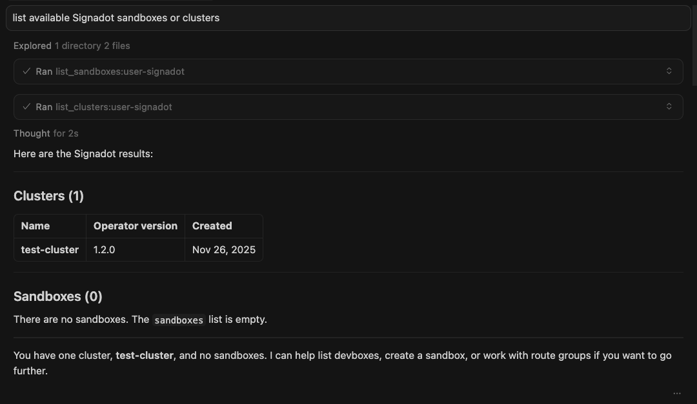


Setup is complete. You can now manage sandboxes with isolated Neon database branches using natural language prompts in Cursor.

## Using Sandboxes with Cursor

The following prompts demonstrate a complete cycle: checking your environment, creating a sandbox with an isolated database branch, testing data isolation, and cleaning up.

### Check Environment and Clean Up

Start with a clean slate. Open Cursor Chat and enter:

**Prompt:**

> “Check my Signadot setup. List all clusters and sandboxes, then delete any sandboxes 
that start with "neon-" to clean up from earlier runs.”
> 

**Expected Response:**

The agent calls the Signadot MCP tools to list your clusters and sandboxes. It then checks for any sandboxes matching the pattern.

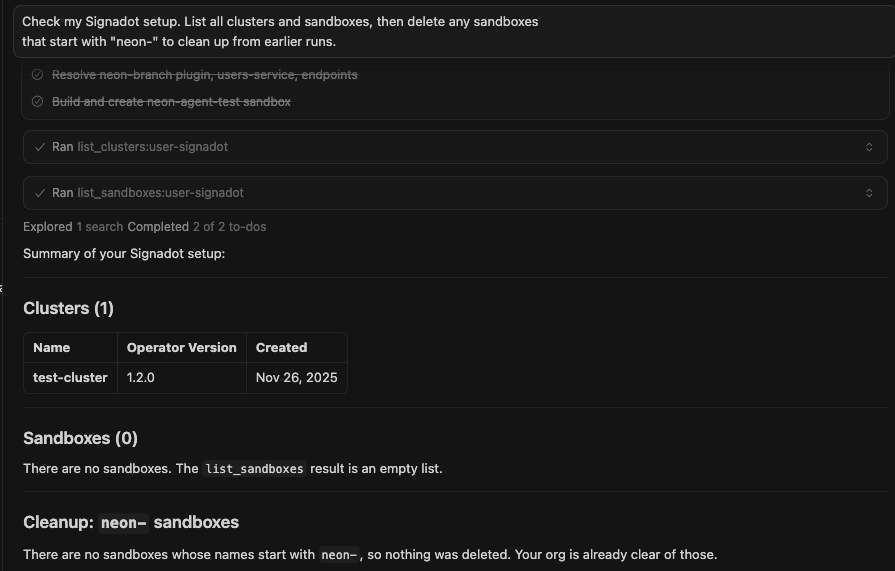

### Create Sandbox with Isolated Database

Now create a sandbox that provisions an isolated Neon database branch. The agent resolves the workload, constructs the sandbox specification, and applies it via the MCP tools.

Ensure you add your actual `project-id` below.

**Prompt:**

> “Create a sandbox called "neon-agent-test" for the users-service deployment in the 
default namespace on my test-cluster. Use the neon-branch resource plugin with 
these parameters:
- project-id: <your-project-id>
- parent-branch: main
- database-name: neondb

The sandbox should override the DATABASE_URL environment variable with the 
connection string from the resource plugin output. Give me the preview URL 
when it's ready.”
> 

**Expected Response:**

The agent resolves the workload, builds the sandbox specification, and presents it for review before creating.

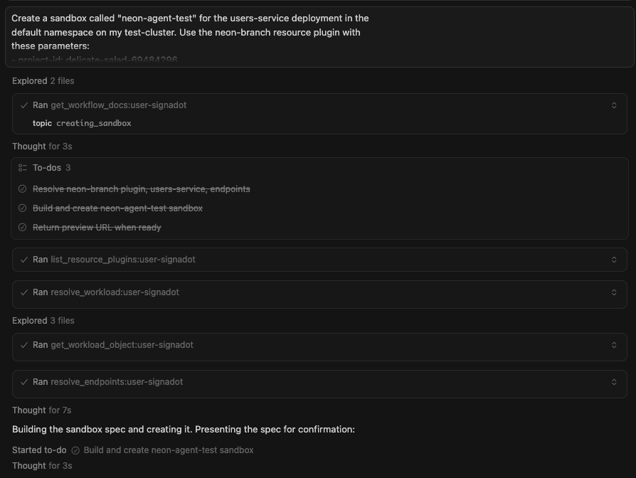

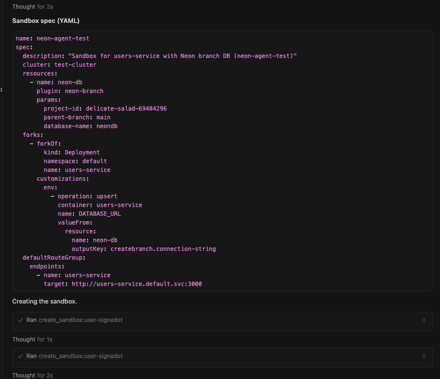

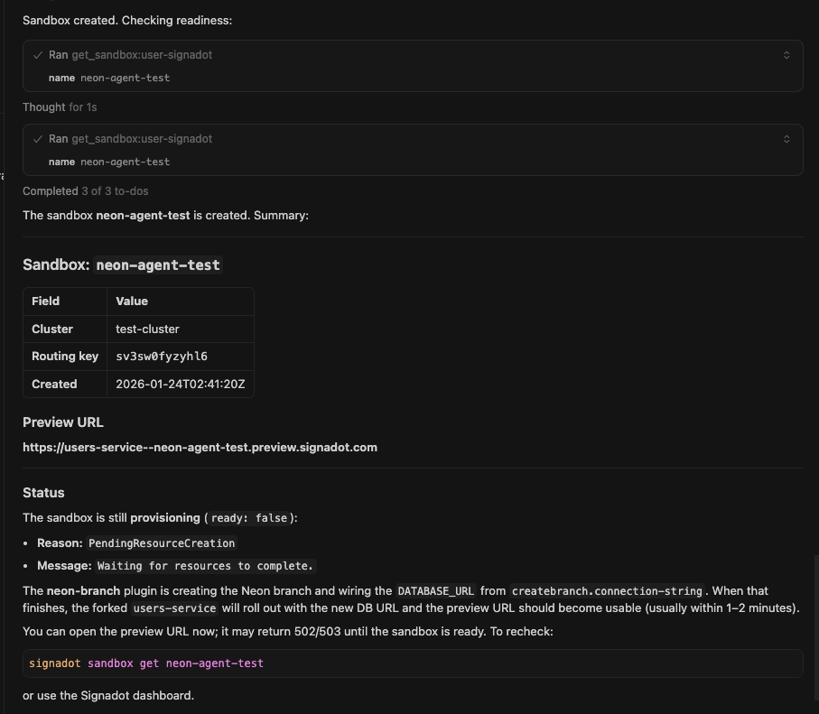

### Verify Sandbox in Signadot Dashboard

Open the [Signadot Dashboard](https://app.signadot.com/) and navigate to **Sandboxes**. You should see the `neon-agent-test` sandbox in the list with a **Ready** status.

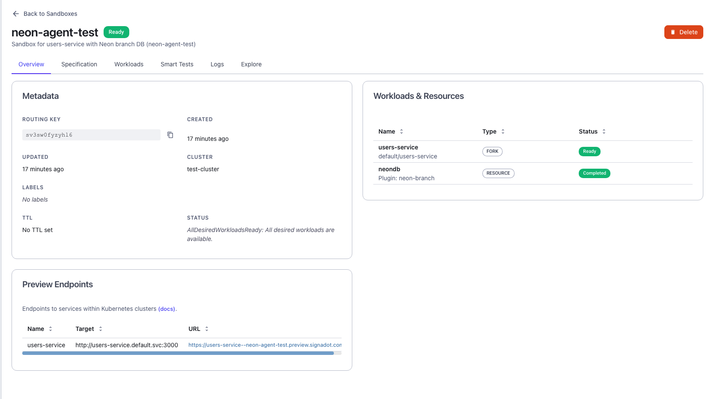

### Verify Branch in Neon Console

Open the [Neon Console](https://console.neon.tech/) and navigate to your project. Under **Branches**, you should see the newly created branch alongside the `main` branch.

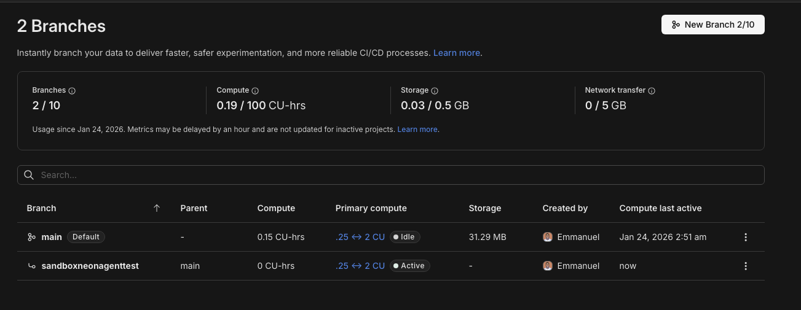

The branch name follows the pattern `sandbox<sandbox-name>` with hyphens removed. The Resource Plugin created this branch automatically when Signadot provisioned the sandbox.

### Test Data Isolation

Test that the sandbox has its own isolated data. The agent runs curl commands and shows you exactly what it executed.

**Prompt:**

> ‘Query the sandbox endpoint at https://users-service--neon-agent-test.preview.signadot.com/users 
to list users. Then create a new test user with name "Agent Test User" and 
email "agent@test.example". Show me the commands you're running.’
> 

**Expected Response:**

The agent uses the `signadot-api-key` header with your API key and shows the exact commands.

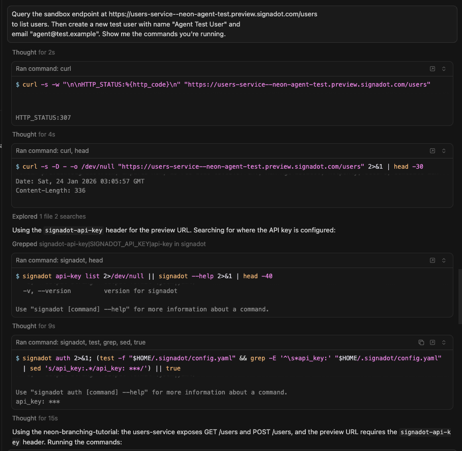

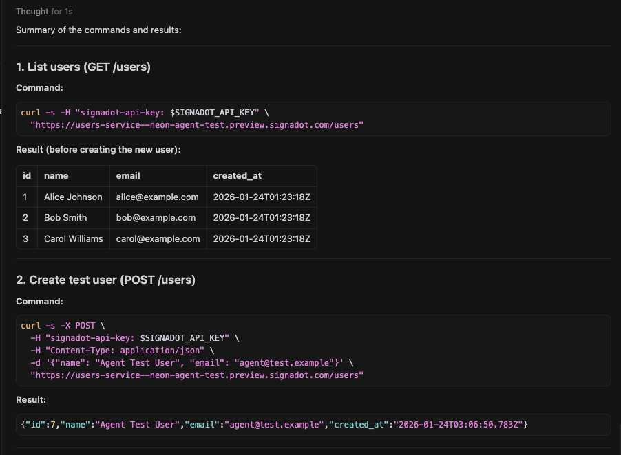

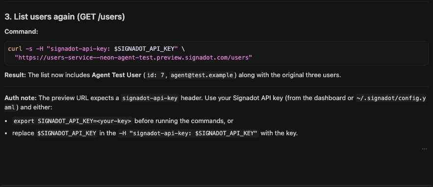

### Cleanup

Clean up the sandbox when you're done. The Resource Plugin automatically deletes the Neon branch.

**Prompt:**

> “Delete the neon-agent-test sandbox.”
> 

**Expected Response:**

The agent uses the Signadot CLI to delete the sandbox and waits for full teardown.

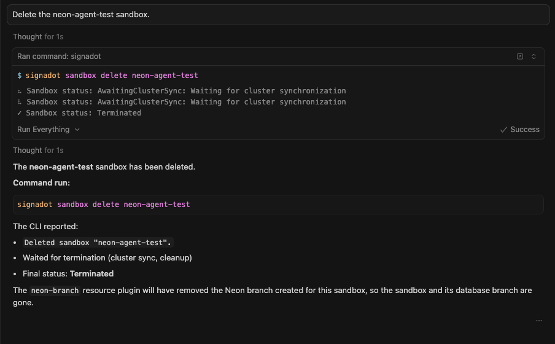

### Verify Sandbox Removal in Signadot Dashboard

Return to the [Signadot Dashboard](https://app.signadot.com/) and navigate to **Sandboxes**. The `neon-agent-test` sandbox should no longer appear in the list.

### Verify Branch Removal in Neon Console

Open the [Neon Console](https://console.neon.tech/) and navigate to your project's **Branches** page. The `sandboxneonagenttest` branch should be gone. Only the `main` branch remains:

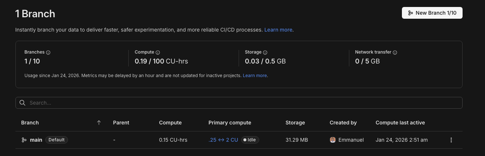

The Resource Plugin's delete workflow ran automatically when the sandbox was deleted, removing the isolated database branch along with all test data. No manual cleanup required.

### What Happens Behind the Scenes

When you ask the agent to create a sandbox, several systems coordinate:

1. **Cursor Agent** receives your natural language prompt
2. **Signadot MCP Server** translates the request into Signadot API calls
3. **Signadot Control Plane** processes the sandbox specification
4. **Resource Plugin** runs the create workflow in your cluster
5. **Neon API** creates the database branch
6. **Sandbox Pod** starts with the connection string injected

The same Resource Plugin that powers the agent workflow also works with the CLI. You write the plugin once and use it from any interface.

### Benefits of Agent-Driven Workflows

Using an AI agent to manage sandboxes offers several advantages:

- **No YAML editing**: Describe what you want in plain English. The agent generates correct specifications.
- **No context switching**: Stay in your IDE. No terminal windows or browser tabs needed.
- **Consistent cleanup**: Agents don't forget to delete sandboxes. Ask once and it's done.
- **Faster iteration**: Create, test, and tear down environments as fast as you can type prompts.

### Other MCP-Compatible Clients

While this guide focuses on Cursor, Signadot's MCP server works with other clients too:

- **VS Code**: Add the configuration to `.vscode/mcp.json` in your workspace
- **Claude Code**: Run `claude mcp add --transport stdio signadot -- signadot mcp`

See the [Signadot MCP documentation](https://www.signadot.com/docs/integrations/mcp) for setup instructions for each client.

## Using the Signadot CLI

For scripted workflows, CI/CD pipelines, or situations where you prefer command-line tools, you can manage sandboxes directly with the Signadot CLI.

The sandbox spec ties everything together. Review `users-sandbox.yaml`:

```yaml
name: "@{sandbox-name}"
spec:
  description: "Users service sandbox with isolated Neon database branch"
  cluster: "@{cluster}"

  resources:
    - name: usersDb
      plugin: neon-branch
      params:
        project-id: "@{neon-project-id}"
        parent-branch: "main"
        database-name: "neondb"

  forks:
    - forkOf:
        kind: Deployment
        namespace: default
        name: users-service
      customizations:
        env:
          - name: DATABASE_URL
            valueFrom:
              resource:
                name: usersDb
                outputKey: createbranch.connection-string

  defaultRouteGroup:
    endpoints:
      - name: users-api
        target: http://users-service.default.svc:3000
```

The key sections:

- **resources**: Invokes the `neon-branch` plugin with project parameters passed at apply time.
- **forks**: Creates a copy of the `users-service` Deployment with the `DATABASE_URL` overridden. The `valueFrom.resource` field references the plugin output directly using the format `<step-name>.<output-name>`. No intermediate Kubernetes Secret is required.
- **defaultRouteGroup**: Creates a preview URL for accessing the sandboxed service.

### Create a Sandbox

Create a sandbox with an isolated database branch:

```bash
signadot sandbox apply -f users-sandbox.yaml \
  --set sandbox-name=my-feature \
  --set cluster=<your-cluster-name> \
  --set neon-project-id=<your-project-id>
```

### Verify Branch Creation

Check the Neon branches:

```bash
neonctl branches list --project-id <your-project-id>
```

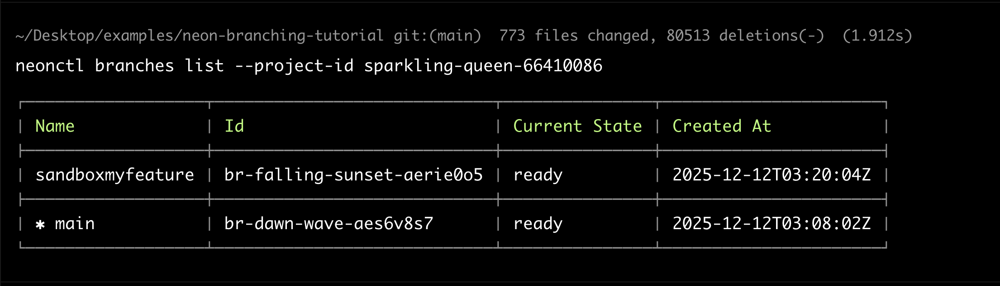

You should see both `main` and `sandboxmyfeature` branches.

### Test Data Isolation

Query the sandbox endpoint to see the inherited seed data:

```bash
curl -H "signadot-api-key: <your-api-key>" \
  "https://users-api--my-feature.preview.signadot.com/users"
```

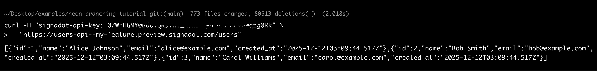

Create a test user in the sandbox:

```bash
curl -X POST \
  -H "signadot-api-key: <your-api-key>" \
  -H "Content-Type: application/json" \
  -d '{"name": "Sandbox User", "email": "sandbox@test.example"}' \
  "https://users-api--my-feature.preview.signadot.com/users"
```

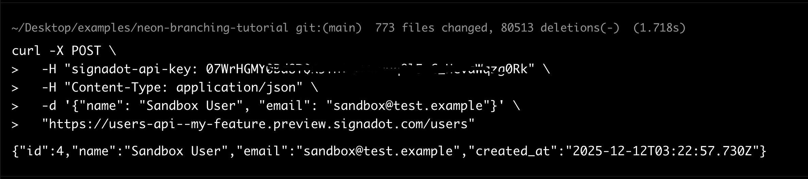

Verify the main branch remains unaffected:

```bash
neonctl connection-string main --project-id <your-project-id> --database-name neondb
psql "<connection-string>" -c "SELECT * FROM users WHERE email = 'sandbox@test.example';"
```

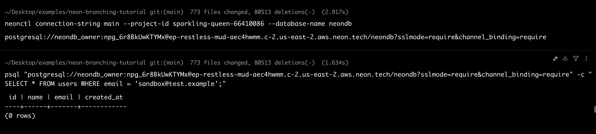

The query returns zero rows. The sandbox user exists only in the branch.

### Cleanup

Delete the sandbox:

```bash
signadot sandbox delete my-feature
```

The Resource Plugin's delete workflow automatically removes the Neon branch:

```bash
neonctl branches list --project-id <your-project-id>
```

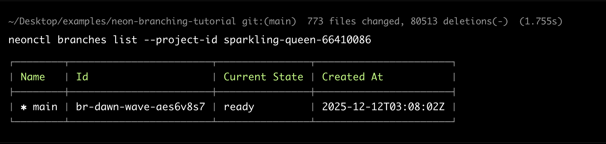

Only the `main` branch remains.

## Conclusion

Each Signadot Sandbox now gets its own forked microservice pods and its own isolated Neon database branch. The Resource Plugin handles the entire lifecycle: creating branches on sandbox creation, exposing connection strings through built-in outputs, and cleaning them up on deletion. Test data cannot leak between sandboxes, and schema migrations in one branch cannot break tests in another.

After completing the one-time setup, developers can manage sandboxes entirely through natural language prompts in Cursor. No YAML editing. No context switching. The Signadot MCP server handles translation between conversational requests and infrastructure operations.

The cost efficiency makes this practical for everyday use. Neon branches use copy-on-write storage, so you only pay for data that changes. Signadot sandboxes share baseline cluster resources. Branch creation and teardown complete in seconds. Every developer gets an isolated app and database for every pull request.