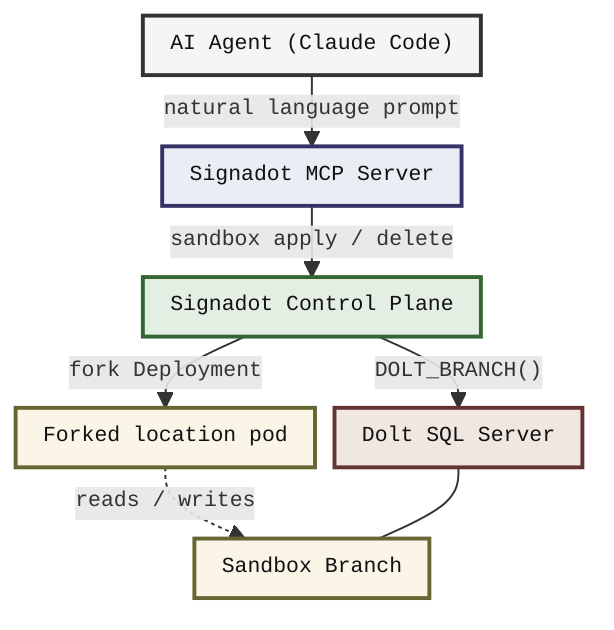
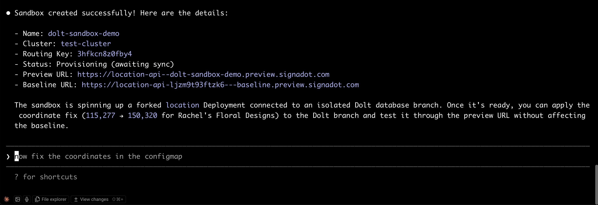
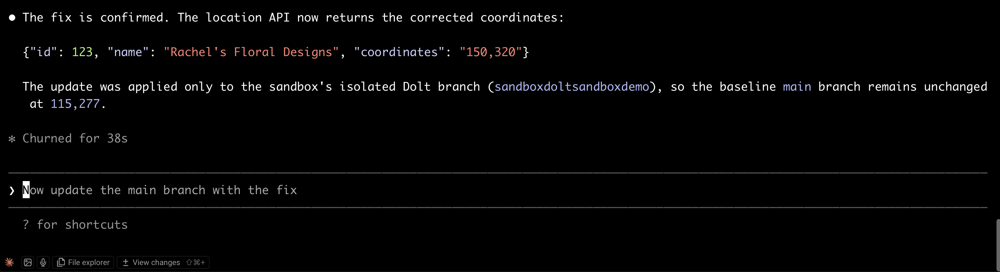
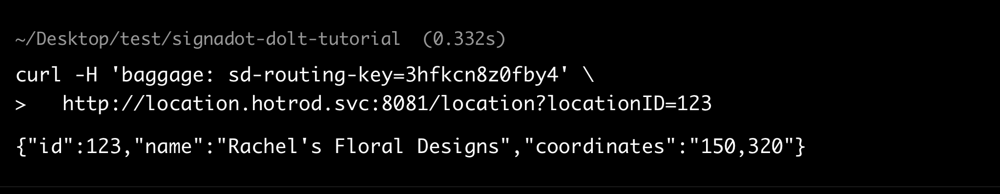
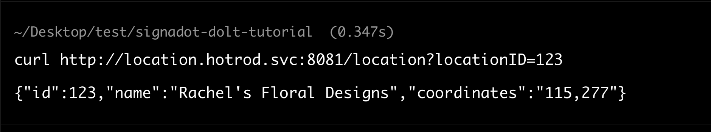
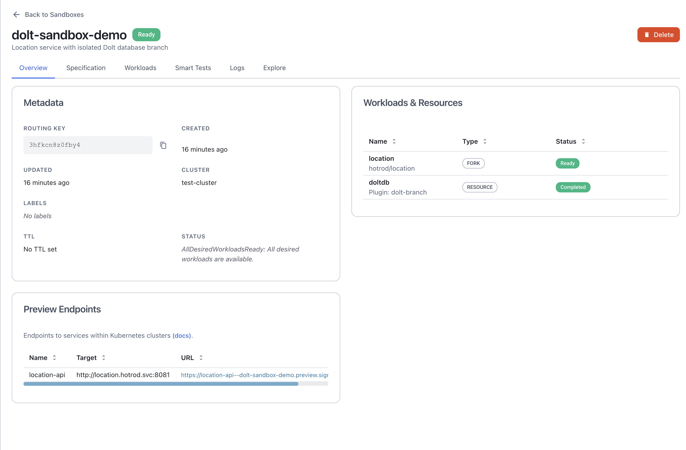
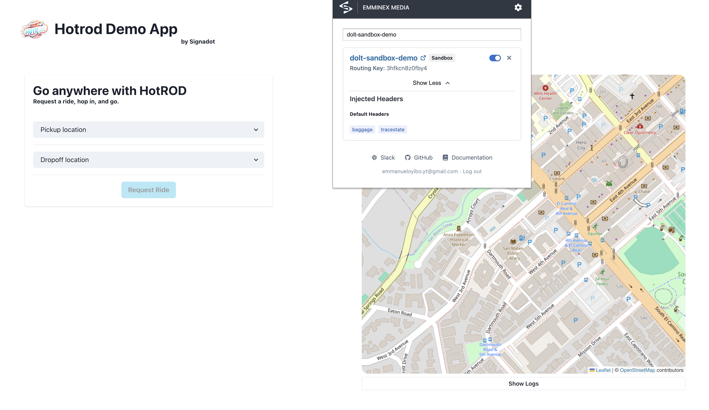
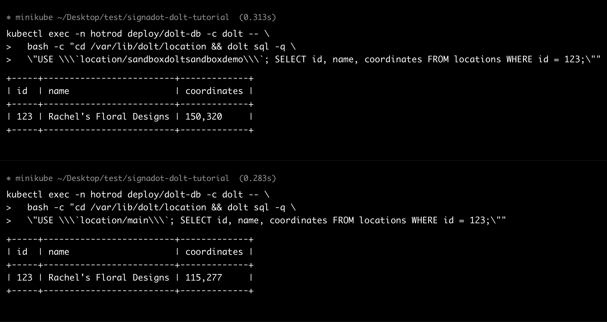
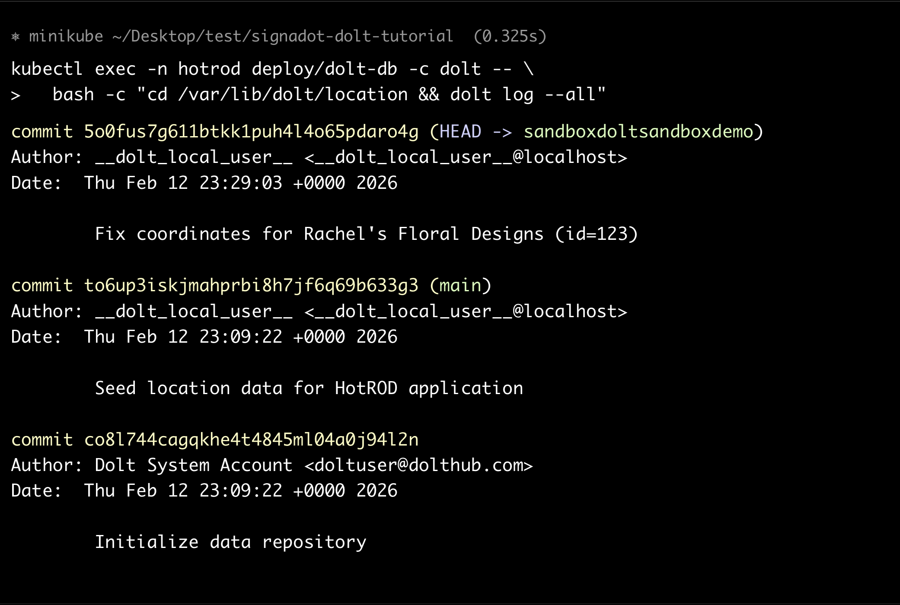

# Building a Closed-Loop Agent Workflow with Signadot MCP and Dolt

## Info Prerequisites

- A Kubernetes cluster (minikube, K3s, or any managed cluster)
- `kubectl` installed and configured for your cluster
- A [Signadot account](https://www.signadot.com/) with the Operator installed in your cluster
- The `signadot` CLI installed ([installation guide](https://docs.signadot.com/docs/getting-started/installation/signadot-cli))
- [Claude Code](https://docs.anthropic.com/en/docs/claude-code/overview) with the [Signadot MCP server](https://docs.signadot.com/docs/integrations/mcp) configured


## Overview

Ephemeral sandbox environments isolate your services, but they still share the same staging database. One developer's test writes corrupt another's query results. Schema migrations break active tests. Seed data vanishes mid-run.

You can fix that with database branching. [Dolt](https://www.dolthub.com/) is a MySQL-compatible database with built-in Git-style version control. [Signadot Resource Plugins](https://docs.signadot.com/docs/reference/resource-plugins) tie Dolt branching into the sandbox lifecycle, creating a branch when a sandbox starts and deleting it when the sandbox is removed.

The [Signadot MCP server](https://docs.signadot.com/docs/integrations/mcp) takes this further. Once configured, an AI coding agent can create sandboxes, test against isolated data, and tear everything down through natural language prompts in your editor, with no context switching and manual commands.

This tutorial, will show you how to set up the integration manually, then use the agent-driven workflow as the primary way to create, test, and manage sandboxes. For setup instructions with other MCP-compatible clients such as Cursor or VS Code, see the [Signadot MCP integration guide](https://docs.signadot.com/docs/integrations/mcp).

## What You Will Build

The end-to-end system works as follows:

1. You deploy a Dolt SQL server in Kubernetes and seed it with location data for HotROD's `location` microservice.
2. You install a Signadot Resource Plugin that creates and deletes Dolt branches.
3. You connect the Signadot MCP server to Claude Code.
4. From that point on, the agent handles the workflow. It creates a sandbox (which triggers a Dolt branch), tests against the isolated endpoint, iterates on the code, and tears everything down when finished.



The agent operates against its own forked service and its own database branch. No other developer's writes interfere, and no leftover test records from a previous iteration pollute the results.

## How It Works

### Dolt Database Branching

Dolt stores every table as a [Prolly Tree](https://docs.dolthub.com/architecture/storage-engine/prolly-tree) (Probabilistic B-tree), a content-addressed data structure that provides B-tree read performance with built-in structural sharing across versions. Creating a branch is a pointer operation. The new branch references the same underlying data as its parent, and only modified rows consume additional storage.

A single Dolt server can host dozens of branches concurrently. Clients can connect to a specific branch using a [database revision specifier](https://docs.dolthub.com/sql-reference/version-control/branches) like `location/sandboxfix728`, passed as the database name in the MySQL connection string.

However, some MySQL client drivers (including Go MySQL driver v1.7.1, which HotROD uses) cannot handle the `/` character in the database name. The Go MySQL driver's [DSN format](https://github.com/go-sql-driver/mysql#dsn-data-source-name) uses `/` as the delimiter between the connection address and the database name (`protocol(address)/dbname`).

A second `/` inside the database name breaks the parser because it cannot determine where the address ends and the database name begins. For applications that use these drivers, you can set the [`@@GLOBAL.<database>_default_branch`](https://docs.dolthub.com/sql-reference/version-control/dolt-sysvars#dbname_default_branch) variable to redirect all connections to a specific branch without changing the database name. 

The app connects to `location` as usual, and Dolt serves the designated branch automatically.

You manage branches entirely through SQL. For example:

```sql
-- Create a branch from main
CALL DOLT_BRANCH('my-feature', 'main');

-- Option 1: Connect using a database revision specifier (requires compatible driver)
USE `location/my-feature`;

-- Option 2: Set the default branch (works with any MySQL driver)
SET @@GLOBAL.location_default_branch = 'my-feature';

-- Delete the branch when done
CALL DOLT_BRANCH('-d', 'my-feature');
```

One key detail: `DOLT_BRANCH()` creates a branch without switching the current session to it. In a multi-session server where other clients are connected, that is safer than `DOLT_CHECKOUT('-b', ...)`, which would switch the session context. See the [Dolt stored procedures reference](https://docs.dolthub.com/sql-reference/version-control/dolt-sql-procedures) for more.

### Signadot Resource Plugins

[Resource Plugins](https://docs.signadot.com/docs/reference/resource-plugins) extend the sandbox lifecycle with custom provisioning logic. A Resource Plugin defines two workflows:

- **create**: Runs before sandboxed workloads start. It provisions an external resource (in our case, a Dolt branch) and writes outputs to files. The Signadot Operator reads those files and makes the values available to sandbox workloads.
- **delete**: Runs after sandboxed workloads terminate. It tears down the resource.

Each workflow executes inside a runner pod in the cluster. Outputs from the `create` workflow flow into sandbox workloads through the `valueFrom.resource` syntax, with no intermediate Kubernetes Secret or ConfigMap required.

### Signadot MCP Server

The [Signadot MCP server](https://docs.signadot.com/docs/integrations/mcp) exposes Signadot's sandbox and route group management as tools that any MCP-compatible AI agent can call. When you connect it to your editor, the agent can create sandboxes, check their status, query endpoints, and delete them through natural language.

Combined with the Resource Plugin, you get a closed loop. The agent asks for a sandbox, the plugin provisions the Dolt branch, the agent runs tests against the isolated endpoint, inspects results, adjusts the code, and repeats.

## Setting Up the Integration

The steps in this section are a one-time setup. Once complete, you will use the agent-driven workflow (covered in the next section) as the primary way to interact with sandboxes.

### Step 1: Clone the Example Repository

```bash
git clone https://github.com/signadot/examples.git
cd signadot-dolt-tutorial
```

The [repository](https://github.com/signadot/examples/signadot-dolt-tutorial) contains all Kubernetes manifests, the Resource Plugin specification, the sandbox spec, and helper scripts:

```
signadot-dolt-tutorial/
├── dolt/
│   ├── dolt-deployment.yaml      # Dolt SQL server Deployment + PVC
│   ├── dolt-service.yaml         # ClusterIP Service (dolt-db.hotrod.svc:3306)
│   └── dolt-init-configmap.yaml  # Seed data (locations table)
├── signadot/
│   ├── dolt-branch-plugin.yaml   # Resource Plugin (create/delete branches)
│   └── sandbox.yaml              # Sandbox spec (forks location service)
└── scripts/
    ├── deploy.sh                 # Deploy Dolt + apply Resource Plugin
    ├── verify.sh                 # Check deployment, branches, sandbox
    └── cleanup.sh                # Tear down everything
```

### Step 2: Deploy the HotROD Application

HotROD ships with two overlays: `devmesh` (uses Signadot's built-in DevMesh sidecars) and `istio` (for clusters running Istio). Choose the one that matches your cluster setup:

```bash
kubectl create ns hotrod

# Use devmesh (recommended for most setups):
kubectl -n hotrod apply -k 'https://github.com/signadot/hotrod/k8s/overlays/prod/devmesh'

# Or, if your cluster runs Istio:
# kubectl -n hotrod apply -k 'https://github.com/signadot/hotrod/k8s/overlays/prod/istio'
```

Wait for all pods to reach `Running` state:

```bash
kubectl get pods -n hotrod

NAME                       READY   STATUS    RESTARTS   AGE
driver-6c49d65f7d-8jmbj    2/2     Running   0          35h
frontend-8d4cb8cd8-4dzvn   2/2     Running   0          35h
kafka-0                    1/1     Running   0          35h
location-69cc499dc-xdrzn   2/2     Running   0          35h
mysql-0                    1/1     Running   0          35h
redis-f6f789cf9-kh2pk      1/1     Running   0          35h
route-75488b64f4-ncbpx     2/2     Running   0          35h
```

The `location` service is the one you will fork with an isolated Dolt branch.

### Step 3: Connect to the Cluster

Run `signadot local connect` to establish a local connection to your cluster. The command configures networking so that you can reach in-cluster services (like `location.hotrod.svc:8081`) directly from your local machine:

```bash
signadot local connect --cluster <YOUR_CLUSTER>
```

Enter your local machine’s password. You should see output confirming a healthy connection:

```
signadot local connect --cluster test-cluster

signadot local connect needs root privileges for:
	- updating /etc/hosts with cluster service names
	- configuring networking to direct local traffic to the cluster
Password:

signadot local connect has been started ✓
* runtime config: cluster test-cluster, running with root-daemon
✓ Local connection healthy!
    * operator version 1.3.0
    * devbox 5ef02b01928205c01f377588524a5594 connected
    * port-forward listening at ":65161"
    * localnet has been configured
    * 22 hosts accessible via /etc/hosts
    * sandboxes watcher is running
* Mapped Sandboxes:
    - No active sandbox
```

Keep this running in the background. The agent and all `curl` commands in this tutorial rely on it to route requests to baseline and sandboxed services.

### Step 4: Deploy the Dolt Database Server

Run the deploy script:

```bash
chmod +x scripts/*.sh
./scripts/deploy.sh
```

If the Signadot CLI is not yet authenticated, the script prompts for your API key. You can generate one from the [Signadot Dashboard](https://app.signadot.com/settings/apikeys) under **Settings > API Keys**. If the CLI is already authenticated, it skips ahead to the Dolt password prompt:

```
./scripts/deploy.sh

=== Step 1: Authenticate Signadot CLI ===
Signadot CLI is already authenticated.

=== Step 2: Create Dolt credentials Secret ===
Enter a password for the Dolt root user: 
secret/dolt-credentials created
Secret 'dolt-credentials' created in namespace 'hotrod'.

=== Step 3: Create init-data ConfigMap ===
configmap/dolt-init-data created

=== Step 4: Deploy Dolt SQL server ===
persistentvolumeclaim/dolt-data created
deployment.apps/dolt-db created

=== Step 5: Create Dolt ClusterIP Service ===
service/dolt-db created

=== Step 6: Wait for Dolt pod to be ready ===
Waiting for deployment "dolt-db" rollout to finish: 0 of 1 updated replicas are available...
deployment "dolt-db" successfully rolled out

=== Step 7: Verify Dolt is accepting connections ===
Dolt pod: dolt-db-5c5bc6549f-vdcb7
+-----+-------------------------+-------------+
| id  | name                    | coordinates |
+-----+-------------------------+-------------+
| 1   | My Home                 | 231,773     |
| 123 | Rachel's Floral Designs | 115,277     |
| 392 | Trom Chocolatier        | 577,322     |
| 567 | Amazing Coffee Roasters | 211,653     |
| 731 | Japanese Desserts       | 728,326     |
+-----+-------------------------+-------------+

=== Step 8: Apply Signadot Resource Plugin ===
Created resource plugin with name "dolt-branch"

=== Deployment complete ===
You can now create sandboxes with:
  signadot sandbox apply -f signadot/sandbox.yaml --set cluster=<YOUR_CLUSTER>
```

Step 7 above queries the `locations` table directly to confirm the seed data is committed.

Next, let’s look into what the script sets up and why each piece matters.

### The Init Script

The script applies `dolt/dolt-init-configmap.yaml`, which contains the SQL that creates the `location` database, a `locations` table, and the five seed records shown above. The schema mirrors the baseline HotROD MySQL database:

```sql
CREATE TABLE IF NOT EXISTS locations (
    id          BIGINT UNSIGNED NOT NULL AUTO_INCREMENT PRIMARY KEY,
    name        VARCHAR(255) NOT NULL UNIQUE,
    coordinates VARCHAR(255) NOT NULL
);
```

The init SQL also calls `DOLT_ADD('.')` and `DOLT_COMMIT(...)` to commit the seed data on the `main` branch. Without this commit, branches created later would not inherit any data.

### The Resource Plugin

The script applies `signadot/dolt-branch-plugin.yaml`, which registers the `dolt-branch` plugin with Signadot. The full specification is in the [repository](https://github.com/signadot/examples/signadot-dolt-tutorial). The key section is the `create` step's script:

```bash
SAFE_NAME=$(echo "${SIGNADOT_SANDBOX_NAME}" | tr -d '-')
BRANCH_NAME="sandbox${SAFE_NAME}"

mysql -h "${DOLT_HOST}" -P "${DOLT_PORT}" \
  -u "${DOLT_USER}" -p"${DOLT_PASSWORD}" "${DOLT_DATABASE}" \
  -e "CALL DOLT_BRANCH('${BRANCH_NAME}', 'main');"

mysql -h "${DOLT_HOST}" -P "${DOLT_PORT}" \
  -u "${DOLT_USER}" -p"${DOLT_PASSWORD}" \
  -e "SET @@GLOBAL.${DOLT_DATABASE}_default_branch = '${BRANCH_NAME}';"
```

The `SIGNADOT_SANDBOX_NAME` environment variable is injected automatically by the Signadot Operator. The script strips hyphens to comply with Dolt's branch naming rules. For a sandbox named `dolt-sandbox-demo`, the resulting branch is `sandboxdoltsandboxdemo`.

After creating the branch, the script sets it as Dolt's default branch for the `location` database. All new connections to `location` will read from the sandbox branch instead of `main`. The app does not need to know the branch name or use a database revision specifier.

The `delete` step runs the inverse: it resets the default branch to `main` and then drops the sandbox branch with `DOLT_BRANCH('-d', ...)`.

The runner uses `debian:bookworm-slim` in the `hotrod` namespace. The `podTemplateOverlay` injects Dolt connection credentials from the `dolt-credentials` Secret you created in Step 4. 

Any Kubernetes objects referenced in the overlay must already exist in the cluster before you create a sandbox. The Signadot Operator does not create them for you.

### Step 5: Understand the Sandbox Specification

The sandbox spec in `signadot/sandbox.yaml` ties the Resource Plugin to a forked `location` service. The full spec is in the [repository](https://github.com/signadot/examples/signadot-dolt-tutorial). Here are the important parts.

The `resources` block declares a dependency on the `dolt-branch` plugin:

```yaml
resources:
  - name: doltdb
    plugin: dolt-branch
```

The `forks` block overrides the environment variables on the `location` Deployment's `hotrod` container so that the forked pod connects to Dolt instead of the baseline MySQL:

```yaml
forks:
  - forkOf:
      kind: Deployment
      namespace: hotrod
      name: location
    customizations:
      env:
        - name: MYSQL_ADDR
          container: hotrod
          value: "dolt-db.hotrod.svc:3306"
        - name: MYSQL_DBNAME
          container: hotrod
          valueFrom:
            resource:
              name: doltdb
              outputKey: createbranch.db-name
        - name: MYSQL_PASS
          container: hotrod
          valueFrom:
            secret:
              name: dolt-credentials
              key: password
```

`MYSQL_ADDR` redirects the forked pod from the baseline MySQL (`mysql.hotrod:3306`) to the Dolt server. `MYSQL_DBNAME` receives the value `location` from the Resource Plugin's output. The HotROD app reads `MYSQL_DBNAME` to determine which database to connect to. Since the Resource Plugin already set Dolt's default branch to the sandbox branch, the app connects to `location` and reads from the correct branch automatically.

The `defaultRouteGroup` block creates a preview endpoint:

```yaml
defaultRouteGroup:
  endpoints:
    - name: location-api
      target: "http://location.hotrod.svc:8081"
```

When Signadot creates the sandbox, it runs the Resource Plugin to create the Dolt branch and set it as the default, forks the `location` Deployment with the overridden environment variables, and registers the preview endpoint. The `@{cluster}` placeholder in the spec is resolved at apply time when you pass `--set cluster=<YOUR_CLUSTER>`.

## Agent-Driven Workflow

With the infrastructure in place, you can now use an AI agent to manage sandboxes through natural language. The examples below use [Claude Code](https://docs.anthropic.com/en/docs/claude-code/overview) with the [Signadot MCP server](https://docs.signadot.com/docs/integrations/mcp).

Let’s imagine a scenario where the HotROD location service has a bug. The coordinates for "Rachel's Floral Designs" (id=123) are `115,277` but should be `150,320`. You want to verify the bug, fix it on an isolated branch, and confirm the fix without leaving your editor.

### The Agent Creates a Sandbox

Prompt the agent:

```
The HotROD location service has a bug. The coordinates for
"Rachel's Floral Designs" (id=123) are wrong. The current value
is "115,277" but it should be "150,320".

Create a Signadot sandbox using the spec in signadot/sandbox.yaml
on my cluster "test-cluster" to test a fix.
```

The agent reads the sandbox spec, resolves the workload and endpoint references, and calls `signadot sandbox apply`. It returns the sandbox details:



However, if Claude Code (or your MCP client of choice) attempts to fix the bug instead of creating the sand box. Explicitly ask it to create the sand box.

### The Agent Verifies the Bug

Ask the agent to confirm the current state:

```
Query the location-api endpoint on my sandbox and check the
current coordinates for the location with id=123.
```

The agent routes a request through the sandbox using `signadot local connect` and the sandbox's routing key header. The local connection handles authentication and header injection automatically, so no API key is needed.

The agent returns:


The bug is confirmed. The coordinates are `115,277` instead of the expected `150,320`.

### The Agent Applies the Fix and Tests

Tell the agent to fix the data on the isolated branch:

```
Update the coordinates for location id=123 on the sandbox's
Dolt branch to "150,320". Then query the endpoint again to
confirm the fix.
```

The agent connects to the Dolt pod via `kubectl exec` and runs the SQL directly through the `dolt sql` CLI. The Dolt CLI handles the `database/branch` revision specifier natively, so the slash in the database name is not a problem here. (The Go MySQL driver limitation only affects the app's network connection to the Dolt server.)

```sql
USE `location/sandboxdoltsandboxdemo`;
UPDATE locations SET coordinates = '150,320' WHERE id = 123;
```

Dolt makes uncommitted changes visible to all connections on the branch immediately, so the fix takes effect as soon as the UPDATE runs.

It then re-queries the endpoint:



The fix works on the sandbox branch.

### Verifying Isolation: Baseline vs. Sandbox

The whole point of database branching is that the fix on the sandbox branch does not touch the baseline. You can verify this yourself with two `curl` commands while `signadot local connect` is running.

**Query the sandbox** (include the routing key header so the request routes to the forked pod):

```bash
curl -H 'baggage: sd-routing-key=nfx8wpjlkwmy4' \
  http://location.hotrod.svc:8081/location?locationID=123
```



**Query the baseline** (omit the routing key header so the request hits the original pod):

```bash
curl http://location.hotrod.svc:8081/location?locationID=123
```



The sandbox returns the fixed value `150,320`. The baseline returns the original value `115,277`.





Both queries go to the same URL. The only difference is the routing key header. Signadot routes the first request to the forked pod (which reads from the Dolt branch), and routes the second request to the original pod (which reads from the baseline MySQL).

You can confirm the same isolation at the database level by querying both branches directly. Since the Resource Plugin changed Dolt's default branch to the sandbox branch, you need to specify `location/main` explicitly to see the baseline data:

```bash
# Sandbox branch has the fix
kubectl exec -n hotrod deploy/dolt-db -c dolt -- \
  bash -c "cd /var/lib/dolt/location && dolt sql -q \
  \"USE \\\`location/sandboxdoltsandboxdemo\\\`; SELECT id, name, coordinates FROM locations WHERE id = 123;\""

# Main branch is untouched (must specify explicitly because the default branch was changed)
kubectl exec -n hotrod deploy/dolt-db -c dolt -- \
  bash -c "cd /var/lib/dolt/location && dolt sql -q \
  \"USE \\\`location/main\\\`; SELECT id, name, coordinates FROM locations WHERE id = 123;\""
```



The sandbox branch returns `150,320`. The main branch returns `115,277`. The two branches share no state and produce no test pollution.

### Inspecting Dolt Commit History

You can inspect the commit history across all branches from the CLI:

```bash
kubectl exec -n hotrod deploy/dolt-db -c dolt -- \
  bash -c "cd /var/lib/dolt/location && dolt log --all"
```



Both branches share the same commit history. The agent's UPDATE modified the working set on the `sandboxdoltsandboxdemo` branch, and Dolt makes those changes visible to all connections on that branch immediately. The agent could also run `DOLT_ADD` and `DOLT_COMMIT` to persist the change in version history, but the app does not require it.

When the sandbox is deleted, the Resource Plugin resets the default branch to `main` and drops `sandboxdoltsandboxdemo`. Dolt uses structural sharing at the storage level, so the branch consumed additional space only for the rows it modified.

### Iterate

The agent retains full context within the same conversation. It knows which sandbox it created, what tests it ran, and what results it observed. If you need to test additional edge cases or adjust the fix, the agent can make changes and re-test without you re-explaining the setup.

Every iteration runs against an isolated service and an isolated database branch, so there is no shared state and no test pollution from other developers.

### Teardown

Once the fix is verified:

```
Delete the sandbox. The fix is verified.
```

The agent calls `signadot sandbox delete` through the MCP server. The Resource Plugin's `delete` workflow runs automatically, resets Dolt's default branch to `main`, and drops the sandbox branch. The cluster returns to its baseline state with zero manual cleanup.

## Managing Sandboxes Without the Agent

If you prefer to manage sandboxes through the CLI, or if you need to script sandbox operations in CI, the following commands cover the full lifecycle. All of these commands assume `signadot local connect` is running.

**Create a sandbox:**

```bash
signadot sandbox apply -f signadot/sandbox.yaml --set cluster=<YOUR_CLUSTER>
```

**Check sandbox status and get the routing key:**

```bash
signadot sandbox get dolt-sandbox-demo
```

**Query the sandbox endpoint using the routing key:**

```bash
curl -H 'baggage: sd-routing-key=<ROUTING_KEY>' \
  http://location.hotrod.svc:8081/location?locationID=123
```

**Verify the Dolt branch was created:**

```bash
kubectl exec -n hotrod deploy/dolt-db -c dolt -- \
  bash -c "cd /var/lib/dolt/location && dolt sql -q 'SELECT * FROM dolt_branches;'"
```

**Delete the sandbox:**

```bash
signadot sandbox delete dolt-sandbox-demo
```

**Tear down the entire Dolt infrastructure (server, PVC, Secret, Resource Plugin):**

```bash
./scripts/cleanup.sh
```

## Conclusion

Each Signadot Sandbox now gets its own forked microservice pod and its own isolated Dolt database branch. The Resource Plugin handles the full lifecycle: creating branches on sandbox startup, exposing connection details through built-in outputs, and cleaning up branches on deletion.

Dolt branches use structural sharing at the storage level, so each branch consumes storage only for the rows it modifies. Combined with Signadot's approach of forking individual services instead of duplicating entire environments, the per-sandbox cost stays low as team size grows.

The MCP integration closes the loop. Once the one-time setup is complete, the AI coding agent handles provisioning, testing, iterating, and tearing down, all from your editor.

All manifests, scripts, and specs from this tutorial are available in the [signadot-dolt-tutorial](http://github.com/signadot/examples/signadot-dolt-tutorial) repository.
