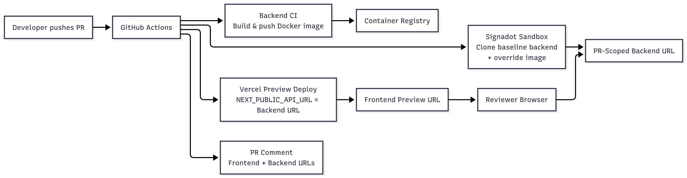

# Tutorial: End-to-End Hot-Reload‑Style Previews with Vercel + Signadot

**Goal:** Give full‑stack teams a hot‑reload‑style workflow where every backend change is previewable as quickly as frontend changes on Vercel.

Frontend developers are used to **instant feedback**: save a file, and the browser updates almost immediately. Vercel previews bring a similar experience to pull requests, where every push spins up a fresh frontend URL. But the **backend usually lags behind**: changes wait for a staging deploy, reviewers test against stale APIs, and full‑stack PRs become slow to validate.

This tutorial shows how to pair **Vercel Preview Deployments** with **Signadot Sandboxes** so that:

1. Every PR can build a fresh backend image and launch a **PR‑scoped backend sandbox** (when configured with a PR‑specific image tag instead of `latest`).
2. The frontend preview is wired to that sandbox via `NEXT_PUBLIC_API_URL` and a secure API proxy.
3. GitHub Actions posts **both URLs** to the PR so reviewers can exercise the feature end‑to‑end.
4. Pushing more commits to the PR updates both sides, giving a **fast-feedback, hot‑reload‑like loop** for backend and frontend together.

**Time required:** 45–60 minutes  
**Repository:** https://github.com/signadot/examples/tree/main/vercel-preview-signadot-sandboxes-cicd-connection

> **Stack note:** The sample app uses a Next.js frontend and a Node/Express backend, but the workflow applies to any framework that can read build‑time environment variables and expose a stable Kubernetes deployment for Signadot to clone.

---

## 1. Introduction

### 1.1 Problem: Fast Frontend, Slow Backend

- Vercel previews give **instant frontend previews per PR**, but they usually point at a **static staging/production backend**.
- When PRs span both frontend and backend, reviewers test UI changes against **outdated APIs**.
- If staging is broken, **every frontend PR looks broken**, even when the frontend code is fine.

### 1.2 Solution: End‑to‑End Hot Reload with Sandboxes

- Create a **Signadot sandbox** for each PR that clones the baseline backend deployment and swaps in the PR’s image.
- Inject the sandbox URL into the Next.js build via `NEXT_PUBLIC_API_URL`, and route calls through a server‑side proxy that keeps the Signadot API key private.
- Use GitHub Actions to orchestrate:
  - backend image build & push,
  - sandbox creation,
  - Vercel preview deployment wired to the sandbox URL,
  - and a PR comment with both preview links.

**Result:** a **full‑stack, hot‑reload‑style workflow** where every push to a PR spins up matching frontend and backend changes, with **instant backend previews** tied to the Vercel preview you already use.

---

## 2. Key Concepts

- **Vercel Preview Deployment (Frontend Hot Reload Experience)**  
  Every PR and push gets its own frontend URL. Frontend developers already rely on this for a **fast feedback loop** during code review.

- **Signadot Sandbox (Instant Backend Preview)**  
  A sandbox is a PR‑scoped backend environment that **clones your baseline Kubernetes deployment** and overrides just the parts you are changing (for example, the backend image tag). This brings a **hot‑reload‑like loop to backend changes**.

- **Full‑Stack Hot‑Reload‑Style Workflow**  
  By wiring the Vercel preview to the PR’s sandbox URL:
  - Each PR gets a dedicated backend + frontend pair.  
  - Reviewers see the exact backend behavior that the frontend expects.  
  - Pushing another commit updates the backend image and redeploys the preview, preserving the **fast‑feedback experience across the whole stack**.

### 2.1 Architecture Overview



---

## 3. Prerequisites

| Requirement | Description |
|-------------|-------------|
| GitHub repositories | Separate frontend (`next.js`) and backend (`express`) repos, or a monorepo |
| Vercel account | Project wired to the frontend repo, API token for GitHub Actions |
| Signadot account | Organization name, API key, access to a Kubernetes cluster with the Signadot Operator installed |
| Kubernetes cluster | AWS EKS or GKE Standard (GKE Autopilot may have restrictions; verify Operator compatibility) |
| Container registry | Docker Hub / GHCR / GCR for pushing backend images |

> **Tip:** Ensure the Signadot Operator is installed ahead of time. The frontend workflow only verifies the operator; it does not install it.

---

## 4. Baseline Environment (One‑Time Setup)

In this section you prepare the **baseline backend environment** that Signadot will clone for each PR. This is a one‑time setup per cluster.

### 4.1 Install the Signadot Operator

Install the operator on your target Kubernetes cluster (for example, an EKS cluster used by your backend):

```bash
kubectl create namespace signadot

helm repo add signadot https://charts.signadot.com
helm repo update signadot

kubectl create secret generic cluster-agent \
  --from-literal=token=$SIGNADOT_CLUSTER_TOKEN \
  -n signadot

helm upgrade --install signadot-operator signadot/operator \
  --namespace signadot \
  --wait
```

**Checkpoint: Operator ready**

- Run:

  ```bash
  kubectl get pods -n signadot
  ```

- **Expected:** At least one `signadot-operator` pod is in `Running` state.

### 4.2 Deploy the Baseline Backend

The backend (`backend/`) is a minimal Express server with Kubernetes manifests under `backend/k8s/`.

1. Update the deployment image to point at your registry:

   `backend/k8s/deployment.yaml`

   ```yaml
   containers:
     - name: vercel-signadot-backend
       image: YOUR_REGISTRY/vercel-signadot-backend:latest
   ```

2. Apply the manifests to your cluster:

   ```bash
   kubectl apply -f backend/k8s/deployment.yaml
   kubectl apply -f backend/k8s/service.yaml
   kubectl get deployment vercel-signadot-backend -n default
   ```

**Checkpoint: Baseline backend healthy**

- Run:

  ```bash
  kubectl get deployment vercel-signadot-backend -n default
  ```

- **Expected:** `AVAILABLE` replicas is at least `1`.

For a local quick check (optional):

```bash
cd backend
npm install
npm run dev
curl http://localhost:8080/health
```

You should see a JSON response with `status: "healthy"`.

### 4.3 Sandbox Blueprint (`backend/sandbox.yaml`)

`backend/sandbox.yaml` defines how Signadot creates a **PR‑scoped backend sandbox** by forking the baseline Deployment:

```yaml
name: backend-pr-PR_NUMBER
spec:
  cluster: CLUSTER_NAME
  description: Sandbox environment for vercel-signadot-backend
  forks:
    - forkOf:
        kind: Deployment
        namespace: default
        name: vercel-signadot-backend
      customizations:
        images:
          - image: docker.io/DOCKERHUB_USERNAME/vercel-signadot-backend:SANDBOX_IMAGE_TAG
        command: ["node", "server.js"]
        env:
          - name: PORT
            value: "3000"
  defaultRouteGroup:
    endpoints:
      - name: backend-api
        target: http://vercel-signadot-backend.default.svc:3000
```

Key ideas:

- `name` becomes PR-specific (for example, `backend-pr-42`).
- `forks/forkOf` clones the baseline Deployment and applies minimal overrides (image, command, env).
- The `images` customization injects the PR-specific image tag built by backend CI.
- `defaultRouteGroup` exposes the sandbox endpoint via the service target URL (yielding URLs like `https://backend-api--backend-pr-42.sb.signadot.com`).

This is the URL we will wire into `NEXT_PUBLIC_API_URL` for a hot‑reload‑style backend experience.

---

## 5. Application Configuration (Frontend + Backend)

With the baseline environment ready, configure the sample app to take advantage of it.

### 5.1 Frontend: Hot‑Reload‑Style Backend URL via `NEXT_PUBLIC_API_URL`

There are two primary ways to route requests to Signadot sandboxes:

- **Chrome Extension (Recommended for developers)**: Install the [Signadot Chrome Extension](https://chromewebstore.google.com/detail/signadot/aigejiccjejdeiikegdjlofgcjhhnkim) to inject routing headers from your browser. With the extension enabled, you open your existing frontend URL (for example, your ingress/load balancer/staging URL), select a sandbox or route group in the extension, and traffic is routed to that sandbox without changing code. Set `NEXT_PUBLIC_USE_SIGNADOT_PROXY=false` in Vercel to use this method.

- **API Key / Proxy Route (Alternative for reviewers & automation)**: Use a server-side proxy route that adds the `signadot-api-key` header for **authenticated preview URLs** (for example, `*.preview.signadot.com`). This works for reviewers who don't have the extension installed and for CI-driven tests, because the proxy keeps the API key server-side. It requires the proxy code below and `SIGNADOT_API_KEY` in Vercel. This is the default behavior (`NEXT_PUBLIC_USE_SIGNADOT_PROXY` defaults to `true`).

The frontend (Next.js 13+) reads its backend URL from `NEXT_PUBLIC_API_URL`. The code automatically detects which method to use based on the `NEXT_PUBLIC_USE_SIGNADOT_PROXY` environment variable.

**`frontend/src/lib/config/api.ts`** (Supports Both Methods)

The code automatically handles both approaches based on `NEXT_PUBLIC_USE_SIGNADOT_PROXY`:

> **Build‑time note:** `NEXT_PUBLIC_API_URL` is evaluated at build time by Next.js and baked into the client bundle. To change which backend a given preview uses, you must trigger a new Vercel build (for example, by pushing a commit or redeploying); changing the environment variable alone after the build does not update existing previews.

```typescript
const API_URL = process.env.NEXT_PUBLIC_API_URL ?? 'http://localhost:8080';

// Defaults to true (proxy) for backward compatibility
// Set to false to use Chrome extension approach
const USE_SIGNADOT_PROXY = 
  process.env.NEXT_PUBLIC_USE_SIGNADOT_PROXY !== 'false';

export function isSignadotUrl(url: string = API_URL): boolean {
  return url.includes('.preview.signadot.com') || url.includes('.sb.signadot.com');
}

export function getApiUrl(endpoint: string): string {
  const path = endpoint.startsWith('/') ? endpoint.slice(1) : endpoint;
  
  if (isSignadotUrl()) {
    if (USE_SIGNADOT_PROXY) {
      // Proxy route adds Signadot API key header server-side for authenticated preview URLs
      return `/api/proxy/${path}`;
    } else {
      // Chrome extension: use existing frontend URL; routing headers injected by the extension
      const base = API_URL.endsWith('/') ? API_URL.slice(0, -1) : API_URL;
      return `${base}/${path}`;
    }
  }
  
  const base = API_URL.endsWith('/') ? API_URL.slice(0, -1) : API_URL;
  return `${base}/${path}`;
}

export function getApiHeaders(): Record<string, string> {
  return { 'content-type': 'application/json' };
}
```

**`frontend/src/app/api/proxy/[...path]/route.ts`** (API Key / Proxy Approach)

This route keeps the Signadot API key **server‑side** while still giving the frontend an instant backend preview. Only needed if using the proxy approach instead of the Chrome extension:

```typescript
export async function GET(request: NextRequest, { params }: Params) {
  const url = `${process.env.NEXT_PUBLIC_API_URL}/${params.path.join('/')}`;

  const response = await fetch(url, {
    headers: {
      'signadot-api-key': process.env.SIGNADOT_API_KEY ?? '',
      accept: 'application/json'
    },
    cache: 'no-store'
  });

  return new NextResponse(response.body, {
    status: response.status,
    headers: response.headers
  });
}
```

When using the proxy approach, all sandbox requests go through `/api/proxy/*`, so `SIGNADOT_API_KEY` is never exposed in client‑side bundles.

**Example component usage**

```typescript
const res = await fetch(getApiUrl('/health'), { headers: getApiHeaders() });
const data = await res.json();
```

**Checkpoint: Local full‑stack dev**

- Start the backend locally on port `8080`.  
- Run the frontend with `NEXT_PUBLIC_API_URL=http://localhost:8080`.  
- **Expected:** the sample page renders the backend health data successfully.

---

## 6. Integration with Sandboxes (GitHub Workflows)

Now that the baseline environment and app configuration are in place, wire them together using GitHub Actions. The goal is to automate the **fast‑feedback loop** for every PR.

### 6.1 Backend CI: Build and Push Images Only

File: `backend/.github/workflows/ci.yml`

Purpose: build, tag, and push backend Docker images so Signadot sandboxes can pull **PR‑specific artifacts**. This workflow **does not** deploy to the cluster or install the operator; those are one‑time baseline steps from the previous section.

Highlights:

- Logs into `REGISTRY` using `DOCKERHUB_USERNAME` / `DOCKERHUB_TOKEN`.
- Tags images with a sanitized branch prefix, short SHA, and `latest` on the default branch.
- Outputs a canonical image reference that matches the registry path used in `sandbox.yaml`.

```yaml
name: Build and Push Backend Image
on:
  pull_request:
    branches: [main, master]
  push:
    branches: [main, master]

jobs:
  build-and-push:
    steps:
      - uses: actions/checkout@v4
      - uses: docker/setup-buildx-action@v3
      - uses: docker/login-action@v3
        with:
          registry: ${{ env.REGISTRY }}
          username: ${{ env.DOCKERHUB_USERNAME }}
          password: ${{ secrets.DOCKERHUB_TOKEN }}
      - uses: docker/build-push-action@v5
        with:
          push: true
          tags: ${{ steps.meta.outputs.tags }}
```

Secrets required in the **backend repo**:

| Secret | Purpose |
|--------|---------|
| `REGISTRY` | Base registry (for example, `docker.io`) |
| `DOCKERHUB_USERNAME` | Registry username |
| `DOCKERHUB_TOKEN` | Registry write token |

**Checkpoint: Image available for sandboxes**

- After pushing a commit, check your registry (for example, Docker Hub).  
- **Expected:** a new image tag exists for `vercel-signadot-backend`, matching the branch and SHA for your PR.

### 6.2 Frontend Preview Workflow: Full‑Stack Hot‑Reload‑Style Preview

File: `frontend/.github/workflows/vercel-preview.yml`

Triggered on `pull_request`, this workflow creates a **PR‑scoped backend sandbox** and deploys a Vercel preview wired to it:

1. **Check out** the frontend repo and backend repo (to read `sandbox.yaml`).
2. **Authenticate to AWS** and configure `kubectl` for the cluster where the baseline backend and Signadot operator run.
3. **Verify the Signadot operator** namespace/pods exist (no install).
4. **Rewrite `backend/sandbox.yaml`** with the cluster name and backend image reference.
5. **Create the Signadot sandbox** and extract its `backend-api` URL.
6. **Deploy to Vercel** with `NEXT_PUBLIC_API_URL` set to the sandbox endpoint. If using the proxy approach, also set `SIGNADOT_API_KEY` as a server‑side secret and `NEXT_PUBLIC_USE_SIGNADOT_PROXY=true` (default). If using Chrome extension, set `NEXT_PUBLIC_USE_SIGNADOT_PROXY=false`.
7. **Comment on the PR** with both frontend and backend preview URLs.

Key excerpt:

```yaml
- name: Prepare Sandbox Configuration
  run: |
    IMAGE_REF=${{ steps.backend-image.outputs.IMAGE_REF }}
    sed -i "s|cluster:.*|cluster: ${{ secrets.AWS_EKS_CLUSTER_NAME }}|g" backend/sandbox.yaml
    sed -i "s|image:.*vercel-signadot-backend.*|image: ${IMAGE_REF}|g" backend/sandbox.yaml

- name: Create Signadot Sandbox
  id: sandbox
  run: |
    SANDBOX_NAME="backend-pr-${{ github.event.pull_request.number }}"
    sed -i "s|backend-pr-PR_NUMBER|${SANDBOX_NAME}|g" backend/sandbox.yaml
    signadot sandbox apply -f backend/sandbox.yaml
    SANDBOX_URL=$(signadot sandbox get "${SANDBOX_NAME}" -o json | jq -r '.endpoints[] | select(.name=="backend-api").url')
    echo "sandbox-url=${SANDBOX_URL}" >> "$GITHUB_OUTPUT"

- name: Deploy to Vercel
  uses: amondnet/vercel-action@v25
  with:
    # Proxy approach (default): Include SIGNADOT_API_KEY and NEXT_PUBLIC_USE_SIGNADOT_PROXY=true
    # Chrome extension: Set NEXT_PUBLIC_USE_SIGNADOT_PROXY=false, omit SIGNADOT_API_KEY
    vercel-args: '--build-env NEXT_PUBLIC_API_URL=${{ steps.sandbox.outputs.sandbox-url }} --build-env NEXT_PUBLIC_USE_SIGNADOT_PROXY=true --env SIGNADOT_API_KEY=${{ secrets.SIGNADOT_API_KEY }} --force'
```

Secrets required in the **frontend repo**:

| Category | Secrets |
|----------|---------|
| Vercel | `VERCEL_TOKEN`, `VERCEL_ORG_ID`, `VERCEL_PROJECT_ID` |
| Signadot | `SIGNADOT_API_KEY` (only if using proxy approach), `SIGNADOT_ORG` |
| GitHub | `BACKEND_REPO`, `GH_PAT` (to check out the backend repo) |
| AWS | `AWS_ACCESS_KEY_ID`, `AWS_SECRET_ACCESS_KEY`, `AWS_REGION`, `AWS_EKS_CLUSTER_NAME` |
| Registry | `DOCKERHUB_USERNAME` (used for image rewrites) |

> **Note:** This workflow uses the Signadot CLI (`signadot sandbox apply/get`). You can substitute `signadot/sandbox-action` if desired; the logic is equivalent.

**Checkpoint: Full‑stack preview workflow**

- Open a PR against the frontend repo.  
- In **GitHub Actions**, you should see:
  - Backend CI building and pushing an image.
  - Frontend preview workflow creating a sandbox and deploying to Vercel.  
- **Expected:** the PR gets a comment with a **Frontend Preview URL** and a **Backend Sandbox URL**.

If you need a visual reference for secrets and API keys, see:

- 
- 

---

## 7. See It Work: Experiencing the Hot‑Reload‑Style Loop

This section walks through what it feels like to **use** the workflow, not just configure it.

### 7.1 Create a Test PR

1. Make a small change in the **frontend** (for example, update the text rendered by the `BackendStatus` component).
2. Optionally, make a small change in the **backend** (for example, add a field to the `/health` response).  
3. Push your branch and open a PR against `main` or `master`.

**Checkpoint: Workflows running**

- In the frontend repo, you should see the **Deploy Full‑Stack Preview** workflow running.  
- In the backend repo, you should see the **Build and Push Backend Image** workflow running.

### 7.2 Inspect the PR Comment and URLs

Once the workflows complete:

1. Scroll to the bottom of the PR to find the comment created by the frontend workflow.  
2. It should list:
   - **Frontend Preview:** a `vercel.app` URL.  
   - **Backend Sandbox:** a `*.sb.signadot.com` or `*.preview.signadot.com` URL.

These two URLs represent your **end‑to‑end instant preview** for that PR.

### 7.3 Validate the End‑to‑End Flow

1. Open the **Frontend Preview URL** in your browser.  
2. Open DevTools → **Network** tab.  
3. Trigger the UI behavior that hits the backend (for example, load the page that reads `/health`).  
4. Inspect the network requests:
   - **If using Chrome extension**: Requests go directly to the sandbox URL (e.g., `https://backend-api--backend-pr-<PR_NUMBER>.sb.signadot.com/health`) with routing headers injected by the extension.
   - **If using proxy approach**: Requests go to `/api/proxy/…` on the Vercel domain, which forwards to the sandbox URL.

**Checkpoint: Instant backend preview**

- **Expected:** the response body reflects the backend version built for this PR, not the shared staging backend. You are now effectively experiencing a **hot‑reload‑style backend workflow** tied to your PR.

### 7.4 Push Another Change and Feel the Loop

To feel the **fast‑feedback loop**:

1. Change something in the backend (for example, modify the `status` message or add a new field to `/health`).  
2. Commit and push to the **same PR branch**.  
3. Wait for:
   - Backend CI to build and push a new image.
   - The frontend preview workflow to recreate or update the sandbox with that new image and redeploy the preview.
4. Refresh the **same** Vercel preview (or the new preview URL if it changed).

**Checkpoint: Hot‑reload‑style full‑stack update**

- **Expected:** the frontend now shows the updated backend behavior, without manually promoting anything to staging. Every push gives you an **instant backend preview** wired to your frontend preview.

---

## 8. Troubleshooting

| Issue | Checks |
|-------|--------|
| Sandbox creation fails | `kubectl get deployment vercel-signadot-backend -n default`, `kubectl get pods -n signadot`, confirm image exists in registry |
| API calls from Vercel fail | Ensure `NEXT_PUBLIC_API_URL` appears in build logs. If using proxy approach: `SIGNADOT_API_KEY` is set (no `NEXT_PUBLIC_`), `/api/proxy/[...path]` exists. If using Chrome extension: extension is installed and sandbox is selected |
| 401/403 from sandbox | If using proxy approach: requests must go through the proxy so the `signadot-api-key` header is added server‑side. If using Chrome extension: ensure extension is enabled and correct sandbox is selected |
| AWS auth errors | Verify `AWS_EKS_CLUSTER_NAME` and `AWS_REGION` secrets; IAM needs `eks:DescribeCluster` |

To debug locally:

```bash
curl https://<vercel-preview>.vercel.app/api/proxy/health \
  -H "signadot-api-key: $SIGNADOT_API_KEY"
```

---

## 9. Next Steps

By pairing Vercel previews with Signadot sandboxes, you:

- Bring the **hot‑reload experience** to your backend with **instant backend previews** per PR.
- Give reviewers a **fast-feedback, end‑to‑end preview** they can trust for every full‑stack change.
- Automate the whole flow with GitHub Actions, so the loop stays fast without extra manual steps.

From here you can:

- Add more services to the same sandbox to preview multi‑service changes.  
- Apply the same pattern to other frontend frameworks that support build‑time env vars.  
- Extend the workflows with checks (for example, integration tests) that also run against the sandbox.

### Additional Resources

- [Signadot Documentation](https://www.signadot.com/docs)
- [Vercel Preview Deployments](https://vercel.com/docs/deployments/preview-deployments)
- [GitHub Actions Documentation](https://docs.github.com/en/actions)

