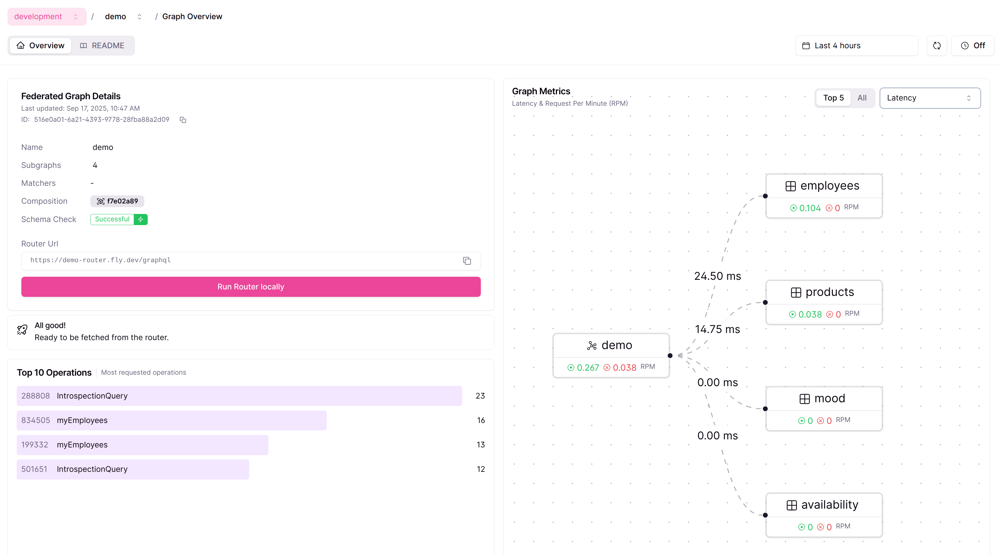
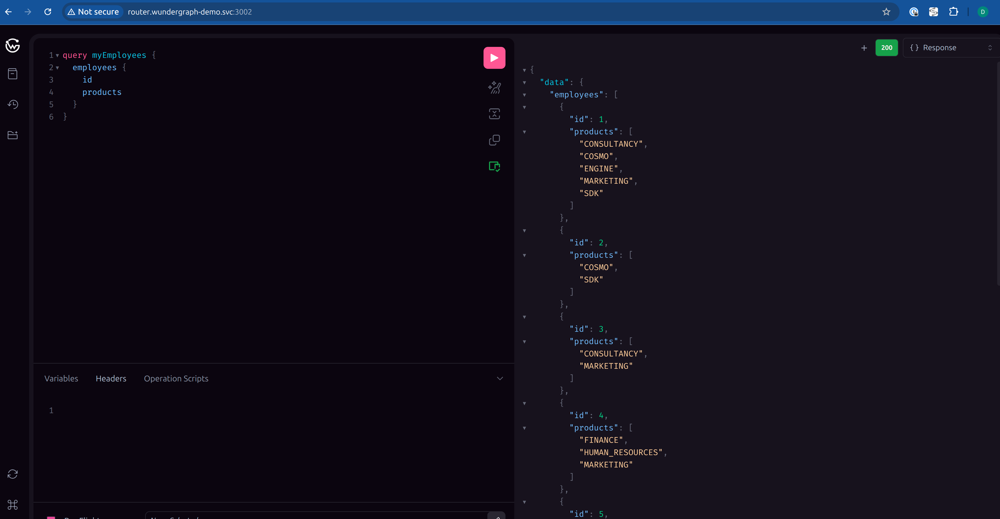
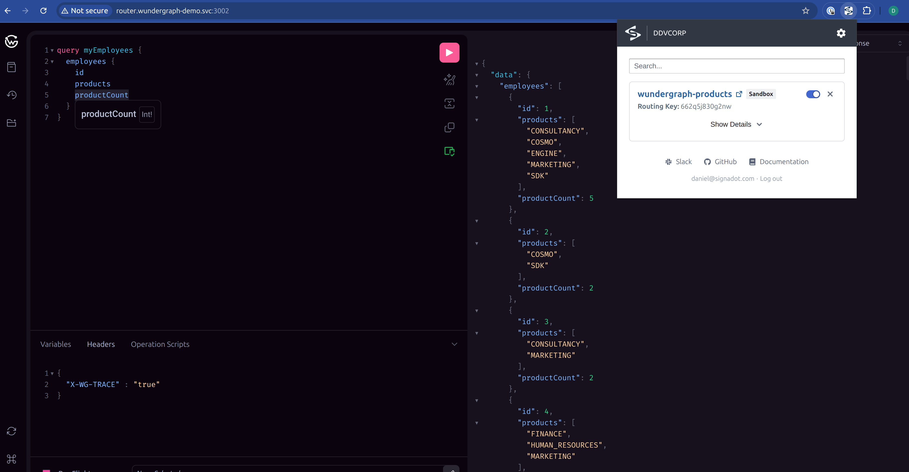
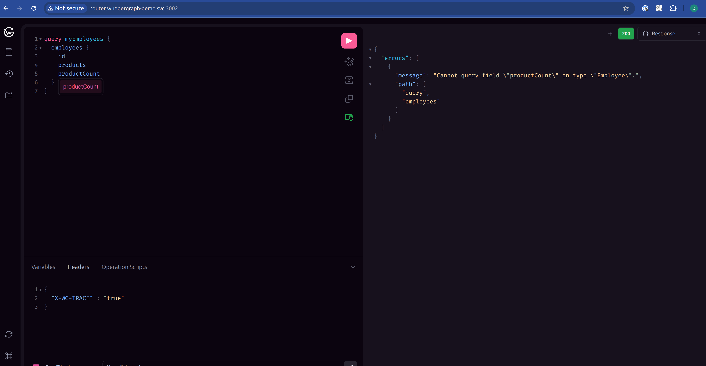
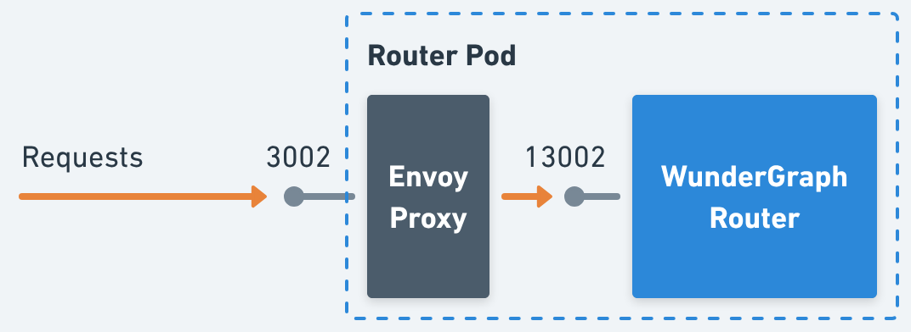
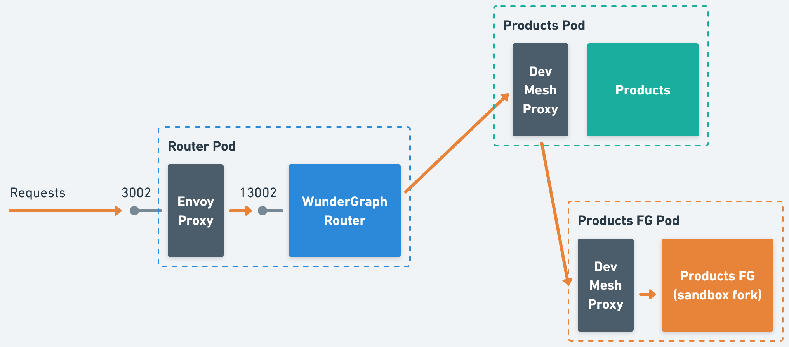

# Using Sandboxes with WunderGraph

# Introduction

One of the common challenges when working with GraphQL is managing **schema evolution**, especially testing changes introduced in a subgraph of a federated API without disrupting baseline traffic.

This document presents an approach to address that challenge by combining **WunderGraph** with **Signadot Sandboxes**, enabling you to validate schema updates in an isolated environment while preserving baseline reliability.

# Baseline Environment

Before we explore how to integrate Sandboxes with WunderGraph, let’s define the **baseline environment**.

We’ll follow the setup described in the [WunderGraph Cosmo Cloud Onboarding](https://cosmo-docs.wundergraph.com/getting-started/cosmo-cloud-onboarding) guide, but adapt it to run on **Kubernetes** (using a local minikube cluster for this demo).

> Prerequisites:
> 
> - `kubectl` and `minikube` installed
> - A WunderGraph Cosmo account
> - The `wgc` CLI installed and authenticated
> - A Signadot account and the operator installed in the cluster
> - The `signadot` CLI installed and authenticated

### Steps

Run the following commands to prepare your environment:

```bash
# Clone the signadot/examples repo
mkdir -p ~/git/signadot/
cd ~/git/signadot/
git clone https://github.com/signadot/examples.git

# Clone the wundergraph/cosmo repo
mkdir -p ~/git/thrid-party/wundergraph/
cd ~/git/thrid-party/wundergraph/
git clone https://github.com/wundergraph/cosmo.git

# Build demo images
cd ~/git/signadot/examples/wundergraph-tutorial
eval $(minikube docker-env)
./build.sh

# Create the WunderGraph federated graph and setup all the subgraphs
./setup-wg.sh

# Create a router token
wgc router token create myName \
    --graph-name demo \
    --namespace development

# Create the namespace and router-token secret
kubectl create ns wundergraph-demo
kubectl -n wundergraph-demo create secret generic router-token \
	--from-literal=token=<route-token>

# Deploy baseline services + the WunderGraph router
kubectl apply -n wundergraph-demo -f ./k8s
```

### Validation

At this point, your federated graph should be active and visible in the [WunderGraph Cosmo Console](https://cosmo.wundergraph.com/).
You can open the console to verify that all subgraphs have been registered and the router is healthy.



You can also explore the router’s **GraphQL playground** locally using Signadot:

1. Start the local connection:
    
    ```bash
    signadot local connect
    ```
    
2. Open the router playground in your browser:
    
    [http://router.wundergraph-demo.svc:3002/](http://router.wundergraph-demo.svc:3002/)
    
3. Paste the following GraphQL query into the editor:
    
    ```graphql
    query myEmployees {
      employees {
        id
        products
      }
    }
    ```
    



# Using Sandboxes

To achieve our goal of introducing schema changes without impacting the baseline environment, we’ll leverage WunderGraph’s Feature Flags capability.

Here’s how it all fits together:

1. Create a fork of the `products` service using the `products_fg` image (an alternative version of the `products` service where some schema updates were introduced).
    
    ```bash
    signadot sandbox apply -f - <<EOF
    name: wundergraph-products
    spec:
      cluster: <cluster-name>
      forks:
        - forkOf:
            kind: Deployment
            namespace: wundergraph-demo
            name: products
          customizations:
            images:
              - image: signadot/wundergraph-demo-products_fg:latest
            env:
            - name: PORT
              value: "4004"
    EOF
    ```
    

1. Using the resulting sandbox routing key from above (referred to as `<routing-key>`), create a WunderGraph feature subgraph and a corresponding feature flag:
    
    ```bash
    wgc feature-subgraph create products-<routing-key> \
     --namespace development \
     --routing-url http://products.wundergraph-demo.svc:4004/graphql \
     --subgraph products
    
    wgc subgraph publish products-<routing-key> \
        --namespace development \
        --schema ./pkg/subgraphs/products_fg/subgraph/schema.graphqls
    
    wgc feature-flag create <routing-key> \
        --namespace development \
        --feature-subgraphs products-<routing-key> \
        --enabled
    ```
    
    You can generalize the procedure above for multiple services as follows:
    
    ```bash
    for <service> in updatedServices; do
      # Create a feature subgraph for each updated service
      wgc feature-subgraph create <service>-<routing-key> \
        --namespace development \
        --routing-url <original-service-url> \
        --subgraph <service>
    
      # Publish the updated schema for the service
      wgc subgraph publish <service>-<routing-key> \
        --namespace development \
        --schema <updated-service-schema>
    done
    
    # Finally, create a single feature flag referencing all subgraphs
    wgc feature-flag create <routing-key> \
      --namespace development \
      --feature-subgraphs <service1>-<routing-key> ... <serviceN>-<routing-key> \
      --enabled
    ```
    

These two steps can easily be automated in a **CI pipeline**: first detect the services that have changed, then create the sandbox, and finally configure and register the feature flag once everything is ready.

### Validation

If you open the **router playground** again, this time under the context of the sandbox you created (in this demo we are using the [browser extension](https://www.signadot.com/docs/guides/developer-environments/access-sandboxes#1-chrome-extension-for-web-applications) to do so), you’ll notice a new property available on the `employee` type: the **`productCount`** field, which is served by the `products_fg` fork.



If you run the same query against the **baseline environment**, you’ll receive an error because the `productCount` field isn’t implemented there.



# How it Works

WunderGraph’s feature flags operate via the [`X-Feature-Flag` header](https://cosmo-docs.wundergraph.com/tutorial/gradual-and-experimental-feature-rollout-with-feature-flags#feature-flag-header).

Because the Signadot **routing key** is typically propagated through standard context propagation mechanisms, such as [W3C Trace Context](https://www.w3.org/TR/trace-context/) and [Baggage](https://www.w3.org/TR/baggage/), we needed a way to convert it into the appropriate feature-flag header.

To achieve this, we added a **proxy** in front of the WunderGraph Router within the deployment.

This proxy intercepts requests, extracts the routing key, translates it into the `X-Feature-Flag` header, and then forwards the request to the actual Router.



For example, if an incoming request includes the following header:

```
Baggage: aaa=bbb, sd-routing-key=<routing-key>, xxx=yyy
```

After passing through the proxy, the request will look like this:

```
Baggage: aaa=bbb, sd-routing-key=<routing-key>, xxx=yyy
X-Feature-Flag: <routing-key>
```

The proxy simply extracts the `sd-routing-key` value from the `Baggage` header and adds it as an `X-Feature-Flag` header, leaving the original `Baggage` header untouched.

Therefore, the **request flow** works as shown in the diagram below:

1. A client request arrives at the **Envoy proxy** (inside the Router Pod) on port `3002`.
2. The proxy translates the `sd-routing-key` (found in the `Baggage` header) into the `X-Feature-Flag` header, then forwards the request to the **WunderGraph Router** (port `13002`).
3. The WunderGraph Router loads the **updated schema** (enabled by the feature flag).
4. To resolve the query, it sends a request to the configured routing endpoint, which points to the original service URL.
5. Because the request includes the **Signadot routing key**, the DevMesh Proxy forwards it to the forked service (`Products FG`), where the experimental schema changes are available.



# Alternatives

In an ideal scenario, we could eliminate the **translation proxy** in front of the Router.
Since Signadot supports sandbox routing using [**custom headers**](https://www.signadot.com/docs/guides/set-up-context-propagation#custom-headers), if the underlying system were able to propagate the `X-Feature-Flag` header directly, we could configure it as a custom routing header in the Signadot Operator. In that case, all routing logic could run entirely off `X-Feature-Flag`, removing the need for an extra proxy layer.

Another option is to extend or fork the [WunderGraph Router](https://github.com/wundergraph/cosmo/tree/main/router) (which is open source) to add support for custom headers. This would allow the Router to read the feature flag directly from the Baggage header, avoiding the translation step altogether.

# Conclusion

By combining **WunderGraph feature flags** with **Signadot Sandboxes**, you can introduce and validate schema changes in a **safe, isolated environment** without disrupting basline traffic.

This approach provides a clean workflow for experimenting with new fields or subgraphs, testing them end-to-end, and rolling them out with confidence.

While the current setup relies on a lightweight proxy to translate routing keys into feature-flag headers, future improvements could simplify the architecture even further.

Adopting this pattern helps teams move faster while maintaining reliability, making it a practical strategy for evolving federated GraphQL schemas in modern Kubernetes environments.