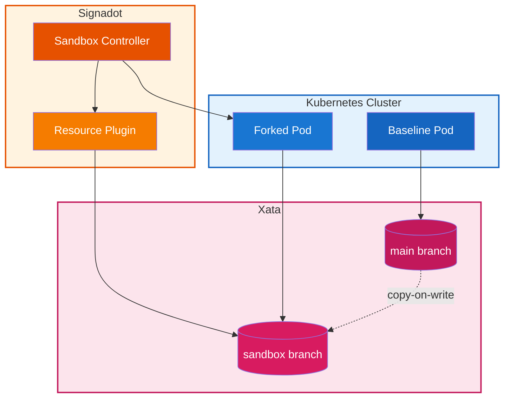
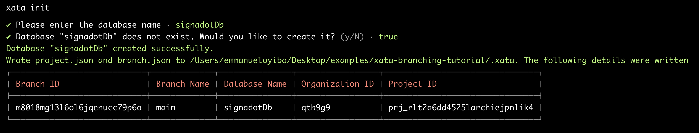
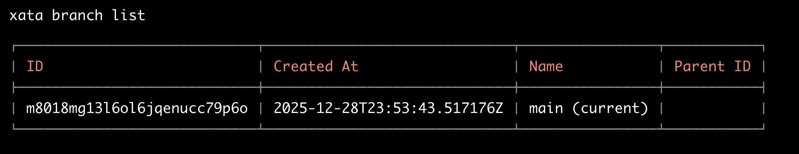
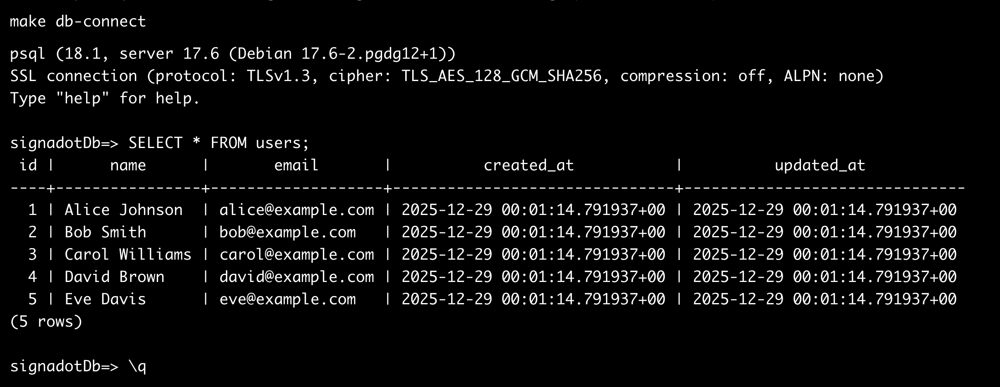
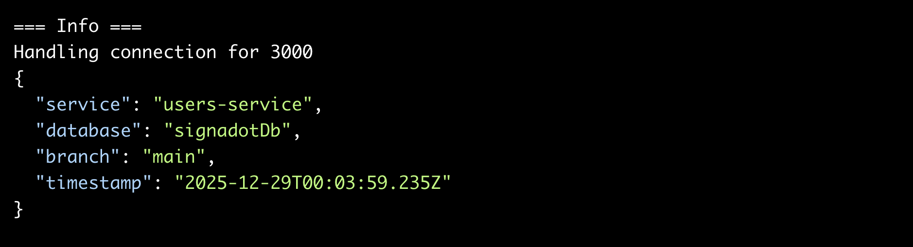
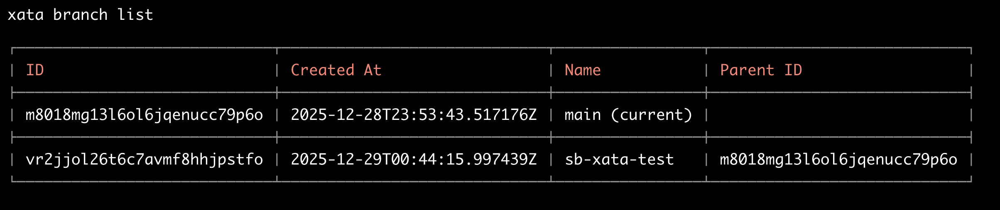
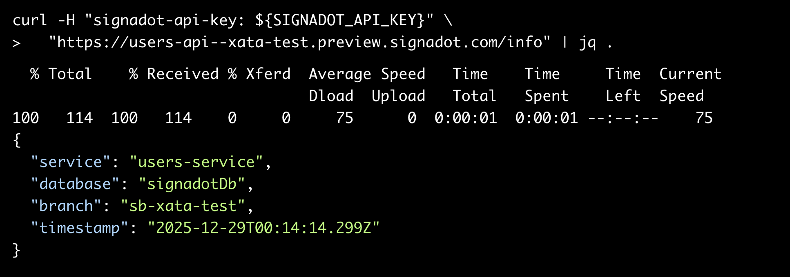
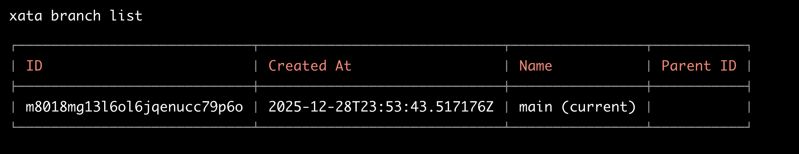

# True "Branch-Based Environments": Combining Signadot Sandboxes with Xata Database Branching

Ephemeral environments solve the "it works on my machine" problem for application code. But what about the database? When five developers test against the same staging database, test data collides, schema migrations conflict, and debugging becomes a nightmare. The environment might be ephemeral, but the shared database state is not.

Xata solves this with copy-on-write database branching. Each branch inherits the full schema and data from its parent but operates in complete isolation. Writes to a branch never affect the parent. Combined with Signadot's sandbox isolation for application workloads, you get true full-stack isolation: every sandbox gets its own forked pods *and* its own database branch.

This tutorial demonstrates how to automate this integration. When a Signadot Sandbox spins up, a Resource Plugin creates an isolated Xata branch. When the sandbox terminates, the branch is deleted. No manual intervention. No leftover resources.

## How It Works

The integration relies on two components:

**Xata Database Branching**: Xata implements branching at the storage layer using copy-on-write semantics. Creating a branch takes seconds regardless of database size because no data is physically copied until a write occurs. Only diverging blocks are duplicated. A 100GB database branches just as fast as a 1GB one.

**Signadot Resource Plugins**: Resource Plugins extend Signadot's sandbox lifecycle with custom provisioning logic. When a sandbox starts, the plugin executes a `create` workflow. When the sandbox terminates, it executes a `delete` workflow. Outputs from the `create` workflow (such as database connection strings) can be injected directly into sandbox pods as environment variables.

**The Integration Flow**:



## Prerequisites

You need:

- A Kubernetes cluster (minikube works fine for this tutorial)
- `kubectl` configured to access your cluster
- A [Xata account](https://xata.io/get-access) with a database created
- A [Signadot account](https://app.signadot.com/) with the operator installed
- The `xata` CLI installed and authenticated
- The `signadot` CLI installed and authenticated
- `psql` (PostgreSQL client) for database operations

Xata requires initial database creation through the dashboard. Once that exists, all subsequent branch operations work via CLI.

## Project Structure

Clone the example repository:

```bash
git clone https://github.com/signadot/xata-branching-tutorial.git
cd xata-branching-tutorial
```

The repository contains everything needed for this integration:

```
xata-branching-tutorial/
├── db/
│   ├── schema.sql              # Table definitions
│   └── seed.sql                # Sample data
├── pkg/users-service/
│   ├── app.js                  # Express.js API
│   └── package.json
├── docker/
│   └── users-service.Dockerfile
├── k8s/
│   ├── namespace.yaml
│   ├── deployment.yaml
│   └── service.yaml
├── signadot/
│   ├── xata-branch-plugin.yaml # Resource Plugin
│   └── users-sandbox.yaml      # Sandbox specification
└── Makefile
```

## Step 1: Configure Xata

### Check Prerequisites

First, verify that all required tools are installed:

```bash
make setup
```

The command checks for `kubectl`, `xata`, `signadot`, `docker`, `psql`, and `jq`. It also verifies that you're authenticated with both Xata and Signadot.

### Initialize Your Project

Run `xata init`:

```bash
xata init
```

The CLI prompts you for a database name. If the database doesn't exist, the CLI offers to create it for you. For the purpose of this tutorial, let’s use `signadotDb`:

Expected output:



### Verify Your Starting Point

Before we create any sandboxes, confirm that only the `main` branch exists:

```bash
xata branch list
```

Expected output:



Only `main` exists at this point. The sandbox will create an additional branch later.

### Create Schema and Seed Data

The Makefile automates schema creation and data seeding:

```bash
make db-setup
```

The command runs `db/schema.sql` and `db/seed.sql` against your `main` branch. The schema creates a `users` table:

```sql
CREATE TABLE users (
    id SERIAL PRIMARY KEY,
    name TEXT NOT NULL,
    email TEXT NOT NULL UNIQUE,
    created_at TIMESTAMP WITH TIME ZONE DEFAULT NOW(),
    updated_at TIMESTAMP WITH TIME ZONE DEFAULT NOW()
);
```

Verify the data:

```bash
make db-connect
```

Then run:

```sql
SELECT * FROM users;
```

Expected output:



These five users exist in the `main` branch. Any branch created from `main` will inherit this data through copy-on-write.

## Step 2: Deploy the Baseline Environment

The baseline represents your shared staging environment, the state that sandboxes fork from.

### Build the Container Image

If using minikube, point your shell to minikube's Docker daemon:

```bash
eval $(minikube docker-env)
```

Build the image:

```bash
make build
```

### Deploy to Kubernetes

Deploy the namespace, secret, deployment, and service:

```bash
make deploy
```

The command creates a `db-creds` secret with your Xata connection string, applies the Kubernetes manifests, and waits for the deployment to become ready.

The deployment includes the DevMesh sidecar annotation for Signadot routing.

### Verify the Baseline

Test the deployment:

```bash
make test
```

The command port-forwards to the service and queries the `/health`, `/users`, and `/info` endpoints.

You should see all five seed users and confirmation that the service connects to the `main` branch:



## Step 3: Install the Signadot Resource Plugin

The Resource Plugin handles the integration between Signadot and Xata. It creates a database branch when a sandbox starts and deletes it when the sandbox terminates.

### Create Credentials and Install Plugin

The Makefile reads credentials from your `.xata` directory and creates the Kubernetes secret automatically:

```bash
make plugin-secret
```

The command:

1. Reads `XATA_ORG_ID` and `XATA_PROJECT_ID` from `.xata/project.json`
2. Reads `XATA_DATABASE_NAME` from `.xata/branch.json`
3. Prompts for `XATA_API_KEY` if not already set
4. Creates the `xata-credentials` secret in the `signadot` namespace
5. Installs the Resource Plugin

Note that this secret is only for API authentication. The database connection string flows through the plugin's output mechanism and gets injected directly into sandbox pods; no manual secret wiring required.

Verify the plugin installation:

```bash
signadot resourceplugin get xata-branch
```

## Step 4: Create a Sandbox

The sandbox specification in `signadot/users-sandbox.yaml` ties everything together.

### The Sandbox Specification

Three sections matter:

**Resources**: Requests a Xata branch from the `xata-branch` plugin:

```yaml
resources:
  - name: usersDb
    plugin: xata-branch
    params:
      parent-branch: "main"
```

**Forks**: Creates a copy of the `users-service` deployment with a modified `DATABASE_URL` environment variable. The value comes from the resource plugin's output:

```yaml
forks:
  - forkOf:
      kind: Deployment
      namespace: demo
      name: users-service
    customizations:
      env:
        - name: DATABASE_URL
          valueFrom:
            resource:
              name: usersDb
              outputKey: provision.connection-string
```

The `outputKey` format is `{step-name}.{output-name}`. Since the create workflow's step is named `provision` and the output is named `connection-string`, the key is `provision.connection-string`.

**Endpoints**: Creates a preview URL for external access:

```yaml
endpoints:
  - name: users-api
    host: users-service.demo.svc
    port: 3000
    protocol: http
```

### Create the Sandbox

Use the Makefile target:

```bash
make sandbox-create
```

The command automatically detects your cluster and creates a sandbox named `xata-test`. Signadot executes the following sequence:

1. Invokes the `xata-branch` plugin's create workflow
2. The plugin creates branch `sb-xata-test` in Xata
3. Signadot captures the connection string output
4. Signadot creates a forked `users-service` pod with the branch-specific `DATABASE_URL`
5. Signadot configures routing to the preview endpoint

Wait for the sandbox to become ready. The CLI shows progress and outputs the preview URL.

## Step 5: Verify Data Isolation

The sandbox now has its own Xata branch. Changes made through the sandbox endpoint affect only that branch.

### Check the Branches in Xata

List branches via CLI:

```bash
xata branch list
```

Output now shows two branches:



The `sb-xata-test` branch was created by the Resource Plugin.

### Query the Sandbox

Preview URLs require authentication with a Signadot API key. Generate one from [app.signadot.com](https://app.signadot.com/) under Settings > API Keys, then export it:

```bash
export SIGNADOT_API_KEY="your-api-key-here"
```

Query the sandbox endpoints:

```bash
curl -H "signadot-api-key: ${SIGNADOT_API_KEY}" \
  "https://users-api--xata-test.preview.signadot.com/users" | jq .
```

The sandbox serves the same five seed users because it inherited them from `main`.

Check which branch the sandbox connects to:

```bash
curl -H "signadot-api-key: ${SIGNADOT_API_KEY}" \
  "https://users-api--xata-test.preview.signadot.com/info" | jq .
```

Output:



The sandbox connects to the `sb-xata-test` branch.

### Create Test Data in the Sandbox

Add a user that only exists in the sandbox branch:

```bash
curl -X POST \
  -H "Content-Type: application/json" \
  -H "signadot-api-key: ${SIGNADOT_API_KEY}" \
  -d '{"name": "Sandbox User", "email": "sandbox@test.com"}' \
  "https://users-api--xata-test.preview.signadot.com/users" | jq .
```

Query the sandbox again:

```bash
curl -H "signadot-api-key: ${SIGNADOT_API_KEY}" \
  "https://users-api--xata-test.preview.signadot.com/users" | jq .
```

You now see six users: the five from seed data plus "Sandbox User".

### Confirm Baseline Is Unchanged

Query the baseline deployment:

```bash
make test
```

The baseline shows only five users. "Sandbox User" does not exist in `main`. The branches are fully isolated.

You can also verify directly against Xata:

```bash
# Query main branch
make db-connect
# Run: SELECT * FROM users;
# Shows 5 users

# Query sandbox branch (switch first)
xata branch checkout sb-xata-test
make db-connect
# Run: SELECT * FROM users;
# Shows 6 users

# Switch back to main
xata branch checkout main
```

## Step 6: Cleanup

Delete the sandbox:

```bash
make sandbox-delete
```

Signadot executes the delete workflow, which runs `xata branch delete` for `sb-xata-test`. The branch and all its data are removed.

Verify the branch is gone:

```bash
xata branch list
```

Output:



Output shows only `main`. The `sb-xata-test` branch no longer exists.

To remove all resources (sandbox, plugin, secrets, and Kubernetes deployments):

```bash
make clean
```

## Cost Considerations

Xata's copy-on-write branching means you only pay for storage that diverges from the parent. A branch that modifies 1% of the data uses roughly 1% additional storage, not a full copy. Compute scales to zero when branches are inactive.

Signadot sandboxes share baseline cluster resources. Forked pods reuse existing infrastructure. You don't provision separate Kubernetes clusters for each environment.

Branch creation and deletion both complete in few minutes. There's no waiting for database restores or provisioning delays.

## Conclusion

Database isolation was the missing piece in ephemeral environments. Combining Xata's copy-on-write branching with Signadot's sandbox orchestration fills that gap. Each developer gets an isolated application layer *and* an isolated database for every pull request.

The Resource Plugin handles the entire lifecycle automatically. Create a sandbox, get a branch. Delete the sandbox, clean up the branch. No scripts to maintain. No orphaned resources.

For more information, see the official [Signadot Documentation](https://www.signadot.com/docs).
